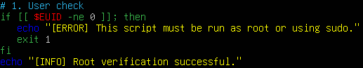
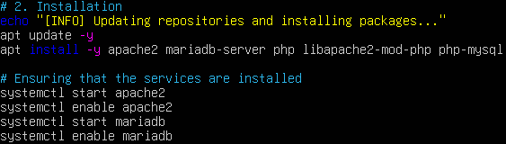
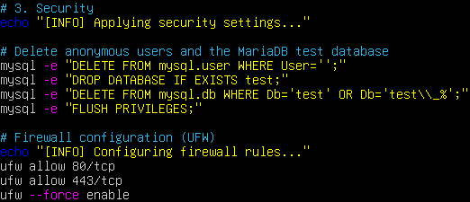
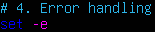
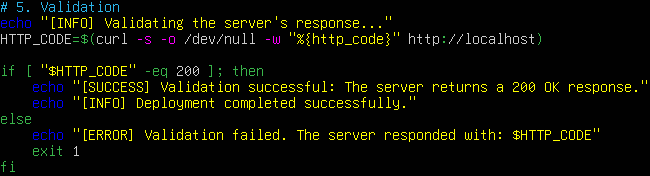
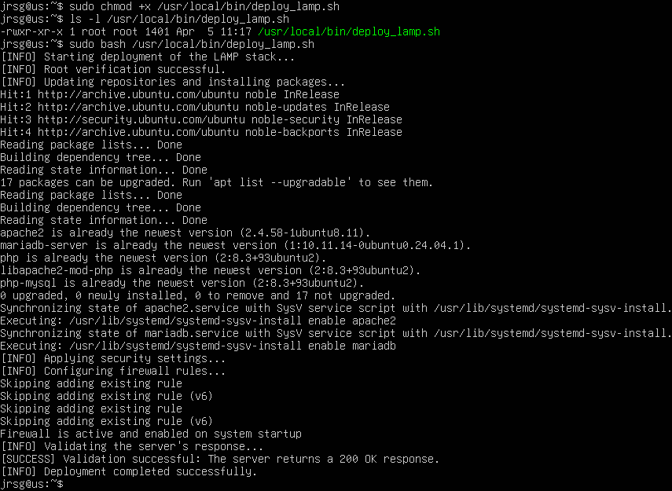

# Bash Scripting Pro

## User Check: Check whether it is running as root.

* `$EUID -ne 0`: Checks whether the current user’s ID is not 0 (which is the root ID).
* `exit 1`: If you are not root, the script terminates with an error code. This is essential because installing software or modifying the firewall requires full permissions.

## Installation: Install Apache, MariaDB and PHP.

* `apt update -y`: Updates the list of packages available in the repositories.
* `apt install -y apache2 mariadb-server php libapache2-mod-php php-mysql`: Installs Apache (server), MariaDB (database), PHP (language) and the necessary connectors. The -y flag automatically answers ‘yes’ to confirmation prompts.
* `systemctl start`: Starts the services immediately.
* `systemctl start`: Configures the services to start automatically every time you boot the virtual machine.

## Security: Perform basic hardening (delete the MariaDB test database, configure firewall rules).

* `mysql -e ‘’`: We delete anonymous users and test databases, and reload the privilege tables so that the changes take effect. This step could have been performed using `mysql_secure_installation`.
* `allow 80/tcp`: Opens standard web traffic (HTTP).
* `allow 443/tcp`: Opens secure traffic (HTTPS).
* `--force enable`: Enables the firewall. Use `--force` so that you are not asked ‘Do you wish to continue (y/n)’ and the script is not halted.

## Error Handling: Use `set -e` so that the script stops if anything fails, and add coloured log messages (green for success, red for error).

* `set -e`: It means ‘stop at the first error’. If any command fails, the script stops immediately rather than continuing and causing further problems.

## Validation: Finally, the script must perform a local curl to confirm that the server responds with a 200 OK.

* `HTTP_CODE=$(curl -s -o /dev/null -w ‘%{http_code}’ http://localhost)`: Sends a web request to the local server and stores only the response code (such as 200) in the HTTP_CODE variable.
* `if [ "$HTTP_CODE" -eq 200 ]; then`: Check whether the stored response code is exactly 200, which is the standard for a successful connection.

## Execution

