# Secure Web Stack

## Network: Set up two VMs. One acts as a ‘Gateway’ (SSH and firewall only) and the other as a ‘Web Server’ (isolated).
The first step is to create two virtual machines, configure their network interfaces, and configure the firewall on our ‘client’ machine:
* **Gateway VM**:
    * Interface 1: Bridge adapter (for Internet access and SSH from your host).

    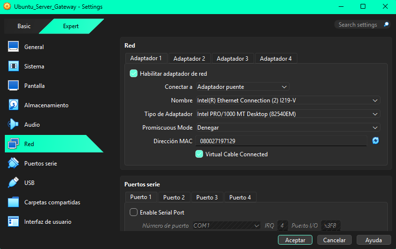

    * Interface 2: Internal Network (name: secure_lan). Static IP: 10.0.0.1.

    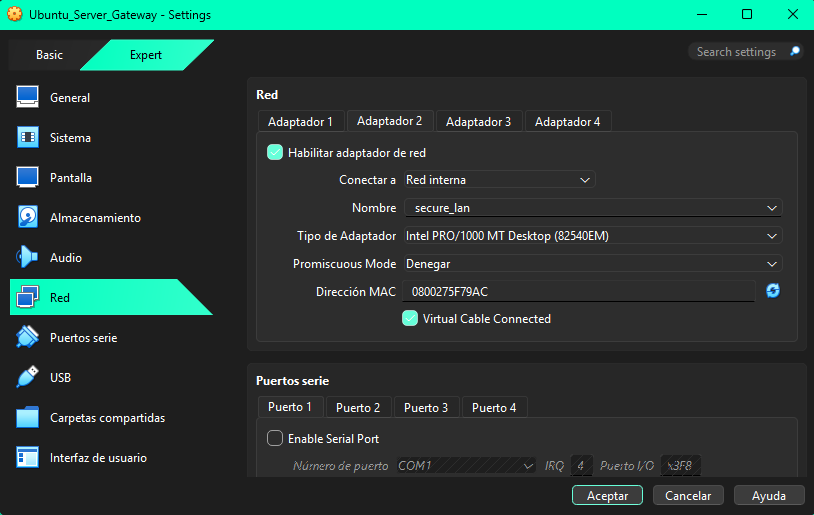

    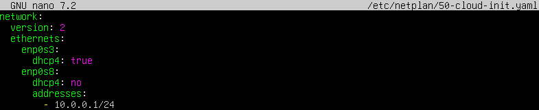

* **VM Web Server**:
    * Interface 1: Internal Network (name: secure_lan). Static IP: 10.0.0.2.

    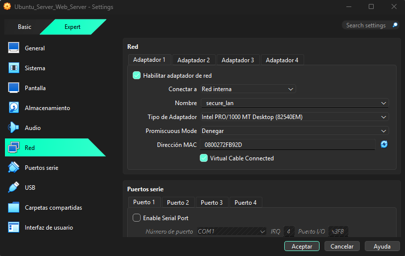

    * Gateway: 10.0.0.1.

    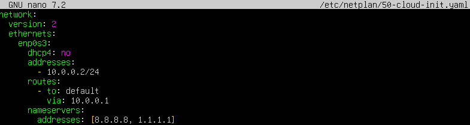

The next step is, on the Gateway VM, to configure the firewall to allow traffic to the web server (ssh 22/tcp) and secure web traffic (http 80/tcp and https 443/tcp):

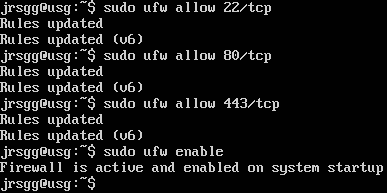

## Services: Install Nginx on the Web VM.
We are now going to configure the Nginx server on our Web Server VM, but first we need to set up an internet bridge from our Gateway VM to our Web Server VM, as the latter does not have internet access and therefore cannot download packages. To do this, we will enable packet forwarding with `sudo sysctl -w net.ipv4.ip_forward=1`. This command opens the operating system’s ‘logical gateway’ so that packets can pass from one network interface to another:

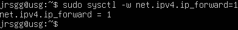

And configure NAT with `sudo iptables -t nat -A POSTROUTING -o eth0 -j MASQUERADE`. This is the NAT (Network Address Translation) command that allows many internal machines to access the internet using a single public IP address (that of your gateway):

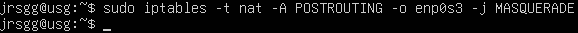

The firewall can cause issues when setting up an internet bridge, so we’re going to change certain settings:
* First, we modify the file `/etc/default/ufw`. We must change the line `DEFAULT_FORWARD_POLICY=‘DROP’` to `DEFAULT_FORWARD_POLICY=‘ACCEPT’`. This gives the firewall explicit permission to act as an intermediary. Now, when the Web Server (10.0.0.2) sends a packet to the Gateway requesting access to Google, the Gateway will not ignore it, but will let it pass through to the other network card.:

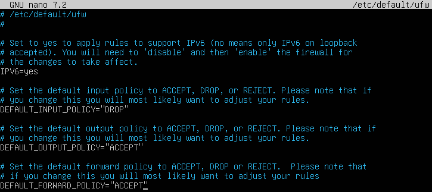

* Secondly, we modify the `/etc/ufw/before.rules` file by adding the following configuration before `*filter`:
    * The gateway receives the packet from the server.
    * Before sending it to the internet (POSTROUTING), the gateway removes the private address 10.0.0.2 from the packet and replaces it with its own public address (the one with internet access).
    * When Google responds, it responds to the Gateway.
    * Thanks to this rule, the Gateway remembers who the packet originally belonged to and returns it to the Web Server.

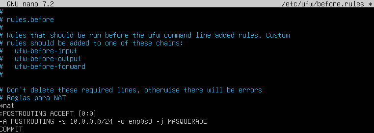

* Thirdly, we restart the firewall:

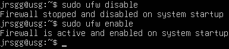

The next step would be, on the Web Server VM, to set the VM Gateway’s IP as the default gateway and apply the changes, but this has already been done in the initial network configuration. Next, connect via SSH from the VM Gateway to the VM Web Server and run the command `sudo apt update && sudo apt install nginx -y` to install the web server:

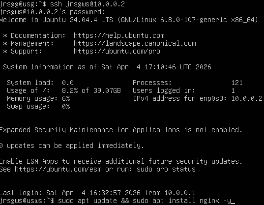

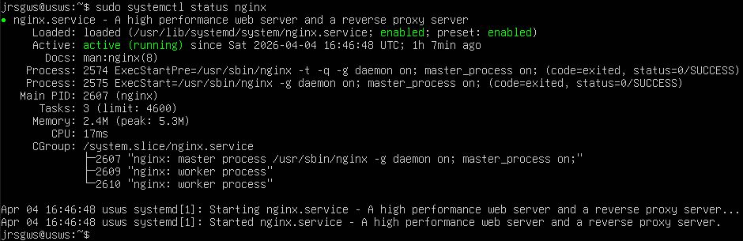

## SSL: Generate a self-signed certificate using OpenSSL and configure it in Nginx.
We will use OpenSSL to create a private key and a certificate valid for 365 days so that we can switch from HTTP to HTTPS:

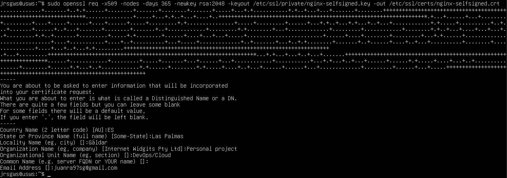

Each part of this command does the following:
* `openssl`: This is the command-line tool for managing certificates, keys and encryption.
* `req`: Tells OpenSSL that you want to make a certificate ‘request’.
* `-x509`: Indicates that you do not want a request to send to an external authority, but rather want to create a self-signed certificate.
* `-nodes`: This is read as ‘no DES’. It means you do not want to protect the private key with a password.
* `-days 365`: Sets the expiry date. In this case, the certificate will be valid for one year. After that, Nginx will return a ‘certificate expired’ error and you will need to repeat the command.
* `-newkey rsa:2048`: Creates a new key using the RSA algorithm with a length of 2048 bits. It is currently the perfect balance between being very difficult to hack and not being too slow for the processor.
* `-keyout /etc/ssl/private/nginx-selfsigned.key`: This is where the private key is stored. It is the server’s “secret”. No one other than the root user should be able to read this file.
* `-out /etc/ssl/certs/nginx-selfsigned.crt`: This is where the public certificate is stored. This is the file your server will send to any browser attempting to connect via HTTPS.

We can now configure our Nginx server for HTTPS by editing the file `/etc/nginx/sites-available/default`:

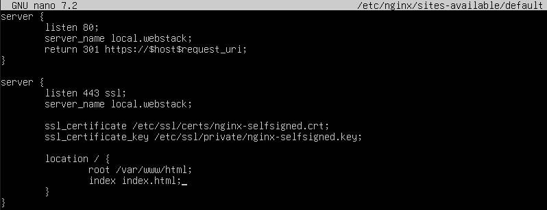

This file is divided into two blocks:
* *The redirect block (port 80)*:
    * `listen 80;`: Tells Nginx to listen on port 80, which is the standard for unencrypted web traffic (HTTP).
    * `server_name local.webstack;`: This is the domain name that this block should serve. If someone types http://local.webstack into their browser, they will be directed here.
    * `return 301 https://$host$request_uri;`: This is the redirect command:
        * `301`: Indicates that the move to HTTPS is permanent.
        * `https://`: Changes the protocol from http to https.
        * `$host`: Retains the domain name (local.webstack).
        * `$request_uri`: Retains what the user was looking for (e.g. /contact.html).

* *The secure server (port 443)*:
    * `listen 443 ssl;`: Listens on port 443, the standard for HTTPS. The word `ssl` tells Nginx to enable the encryption engine for this port.
    * `server_name local.webstack;`: As before, this specifies that this block responds to that domain name.
    * `ssl_certificate ...;`: Tells Nginx where to find the public certificate.
    * `ssl_certificate_key ...;`: Tells it where the private key is located.
    * `location / { ... }`: The / symbol means ‘the root’. This configuration applies to any path the user requests (home, photos, folders, etc.).
    * `root /var/www/html;`: This is the physical folder on your hard drive where the website files (the index.html file) are located.
    * `index index.html;`: This causes index.html to be displayed as the default file.

## Logging: Configure the Web VM so that Nginx logs can be viewed via journalctl.
By default, Nginx writes to `/var/log/nginx/access.log`. To view the logs via journalctl, we need to redirect them to the systemd log collector. To do this, we will modify the Nginx configuration (`/etc/nginx/nginx.conf`):

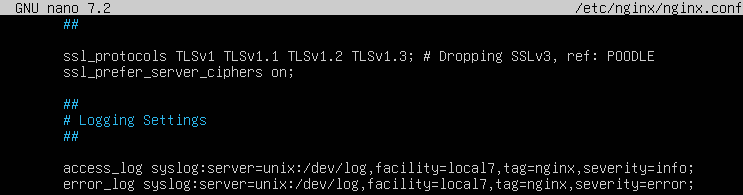

From the Web Server VM, we will restart Nginx and run `journalctl -u nginx.service -f` to view the logs for our website:

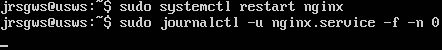

To see any logs, we need to run a curl command to our web server’s IP address, but first we’ll set up an index.html file so that it returns a response when we run the curl command. First, we create the file, then we set the necessary permissions. Nginx uses the *www-data* user; if that user cannot read the folder, it returns a 403 error.

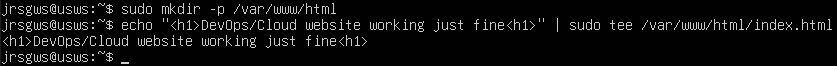

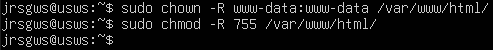

We run the curl command on our Gateway VM to our Web Server VM and check if any logs appear:

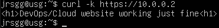

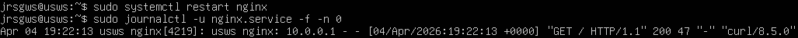