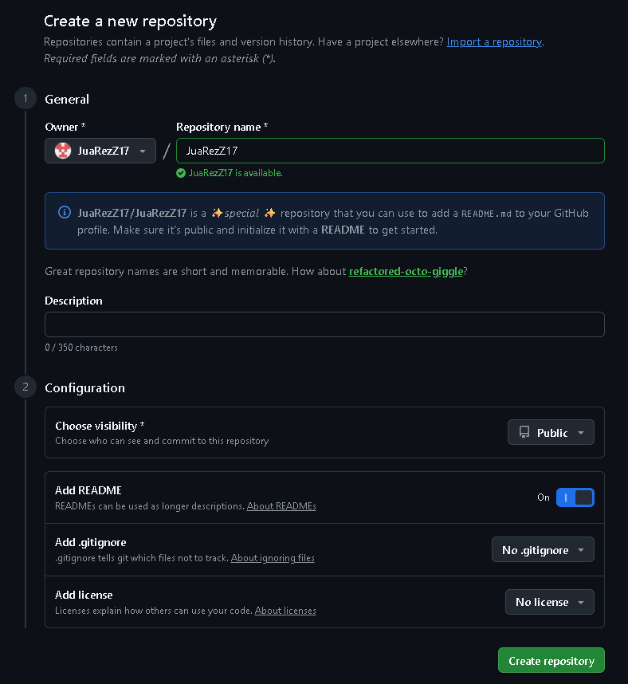
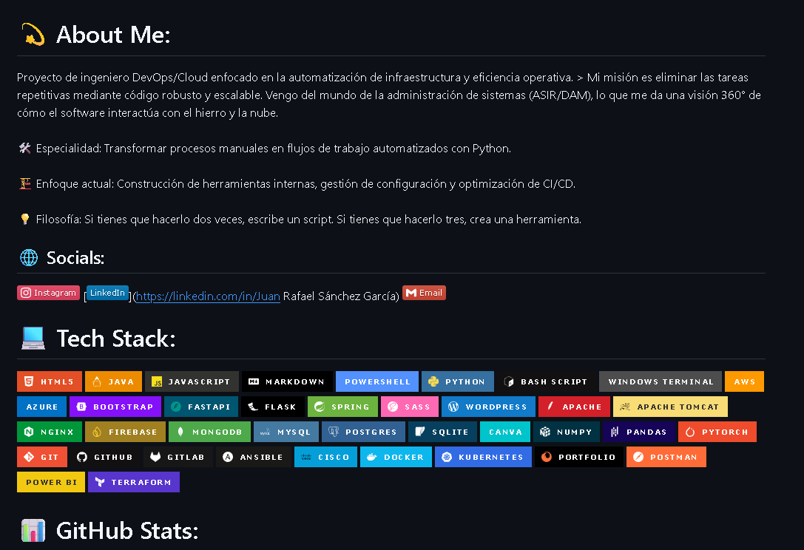
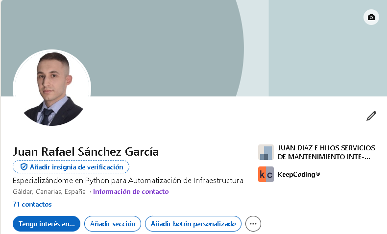

# Branding & Portafolio

## Objetive
Make sure a recruiter sees your profile and knows that you’re an engineer, not an ‘amateur’.

### GitHub Profile: Crea un repositorio especial con tu nombre de usuario (ej. github.com/tu-usuario/tu-usuario) para activar el README de perfil. Usa GPRM para un diseño pro.

### Creación de README para los proyectos anteriores.
Check today's commit.

### LinkedIn: Actualiza tu descripción. Ya no solo tienes ASIR/DAM; ahora estás "Especializándote en Python para Automatización de Infraestructura".

