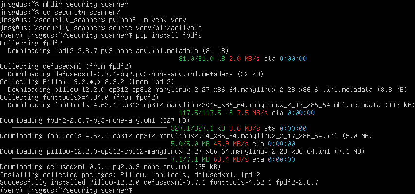
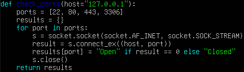
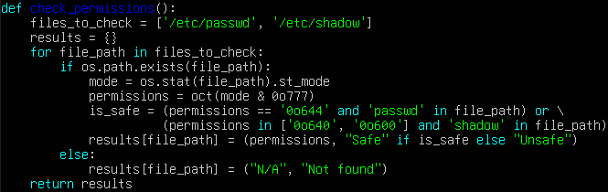
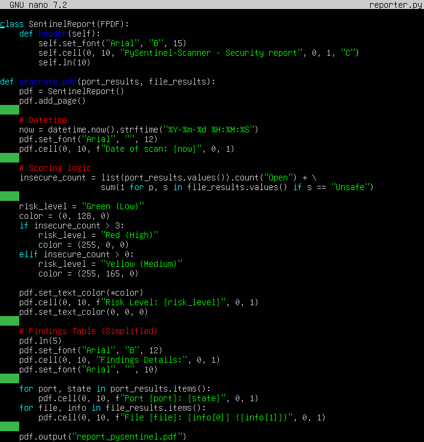
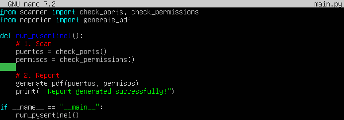
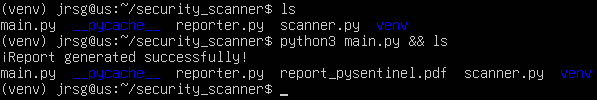
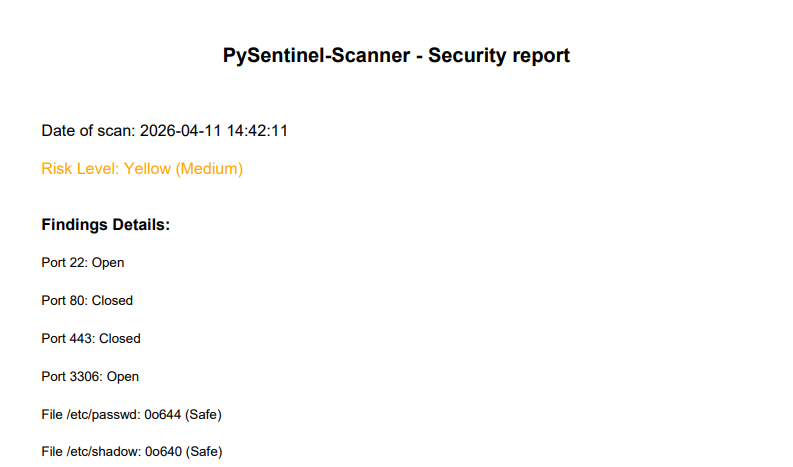

# PySentinel-Scanner

## Prerequisites
The first step in this project is to set up the virtual environment and install the fpdf2 library:

## Port Check: Scan to see if critical ports (22, 80, 443, 3306) are open on localhost.

The most important lines in this method are:
* **`s = socket.socket(socket.AF_INET, socket.SOCK_STREAM)`:** This line specifies the type of connection to be used:
    * *`AF_INET`*: Indicates that we will use IPv4 addresses.
    * *`SOCK_STREAM`*: Indicates that we will use the TCP protocol.   
* **`result = s.connect_ex((host, port))`:** Returns the port status:
    * *If it returns 0*: The connection was established, the port is open, i.e. a service is using it.
    * *If it returns any other number*: An error occurred; the port is closed, i.e. the port is free.

## Permissions Check: Check whether /etc/shadow or /etc/passwd have insecure permissions.

The most important lines in this method are:
* **`mode = os.stat(file_path).st_mode`:** The os.stat() function retrieves all technical information about a file. The .st_mode attribute contains an integer representing both the file type and its permissions.
* **`permissions = oct(mode & 0o777)`:** oct(): Converts that binary number to octal.
* **`is_safe = (permissions == “0o644” and “passwd” in file_path) or (permissions in [“0o640”, “0o600”] and “shadow” in file_path)`:** We check that the permissions for both files are correct. 644 for `etc/passwd` and 640 or 600 for `/etc/shadow`.

## PDF Report: Use a library such as fpdf to generate a professional report containing: Scan date and time, table of findings & risk score (Green/Yellow/Red).

* **`insecure_count = list(port_results.values()).count(‘Open’) + sum(1 for p, s in file_results.values() if s == ‘Insecure’)`:** We quantify the system's vulnerability:
    * *`.count(‘Open’)`*: Counts how many ports are open.
    * *`sum(1 for p, s in file_results.values() if s == ‘Unsafe’)`*: This is a ‘list comprehension’ that counts how many files have dangerous permissions.

* **`pdf.set_text_color(*color)`:** The asterisk is an ‘unpacker’. As `color` is a tuple, the asterisk passes the three numbers separately to the `set_text_color` function.

## Execution

