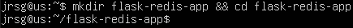
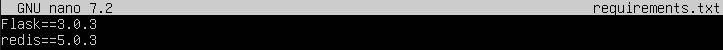
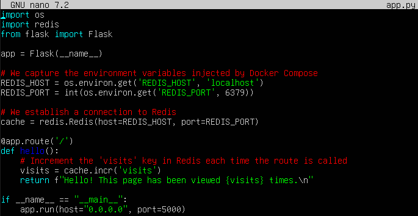
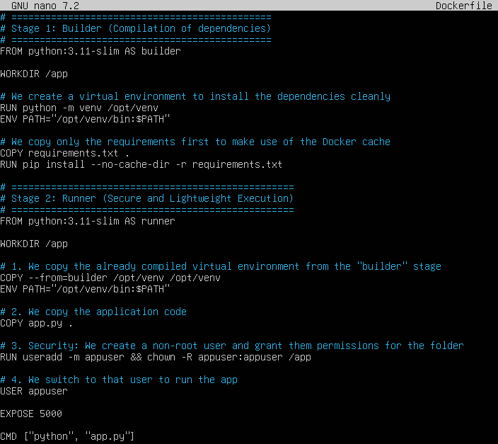
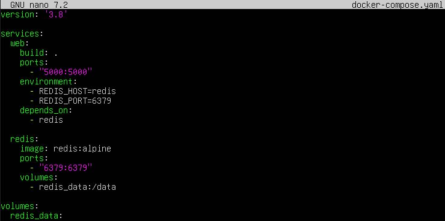
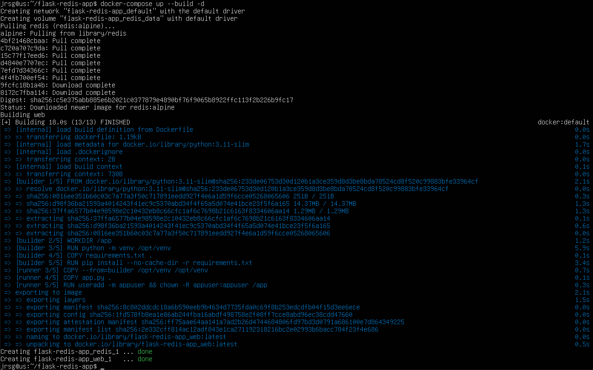
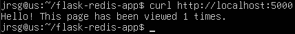
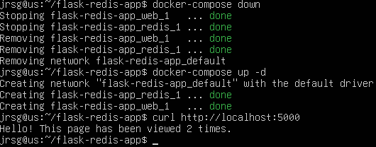

# Flask + Redis Hit Counter

## Objetive
Apply everything you have learnt over the past three weeks (Linux, Python, Docker) by simulating a real-world scenario in which a DevOps Engineer receives code from a developer.

### The Code (Developer): Write a very simple app in Python (Flask) that connects to Redis and increments a counter every time someone visits the page.
To start with, create a folder called `flask-redis-app` and navigate to it:

We need two files for the application: the main Python code and the file that declares the dependencies:

Key points to understand:
- **`os.environ.get(“REDIS_HOST”, “localhost”)`:** This is crucial in DevOps. The application does not have the database IP address “hardcoded” (written directly into the code). It reads an environment variable, which will allow us to inject the connection from Docker.
- **`cache.incr(“visits”)`:** This is an atomic Redis operation that increments the value of the “visits” key by 1 very quickly and securely.

### The Dockerfile (DevOps): Write a Dockerfile for the Python app.
#### Mandatory: It must be a multistage build. Compile the dependencies (pip install -r requirements.txt) in a ‘builder’ stage and pass them to a final ‘runner’ stage based on python:3.11-slim.
#### Security: Add a non-root user and run the app using that user.

Key points to understand:
- **`FROM ... AS builder` and `COPY --from=builder`:** This is the multistage pattern. In the first stage, we download and compile tools that we don’t need in production. In the second stage, we simply copy the final result (`/opt/venv`). Your final image will be much smaller.
- **`RUN useradd -m appuser` and `USER appuser`:** By default, containers run as root. If an attacker compromises your Flask app, they would have full control of the container. By creating and using `appuser`, we limit the potential damage.

### Infrastructure (Docker Compose): Write a docker-compose.yml file that:
#### Starts a Redis container (using the official Alpine image).
#### Builds (build: .) and starts your Flask app.
#### Injects the Redis connection URL via environment variables.

Key points to understand:
- **`environment: - REDIS_HOST=redis`:** This is where the magic happens. The app looks for Redis under the name `redis`, which is exactly the name of the other service in this Compose file. Docker includes an internal DNS server that will automatically resolve the name `redis` to the IP address of that container.
- **`depends_on: - redis`:** Tells Docker to start Redis before our web application.
- **`volumes: - redis_data:/data`:** Maps the internal Redis directory (`/data`) to a Docker-managed volume on your computer. This is what ensures data persistence even if the container is destroyed.

### Testing: Make sure it works on localhost. Stop the stack, restart it, and check that the visit counter is retained (persistence in Redis if configured, or at least that the connection is working).
To check that everything is set up correctly, we’re going to set up the infrastructure and run a `curl` command to the web address:

Now let’s test persistence. We’re going to stop and delete the containers, but the volume where the visits are stored should remain intact and continue counting:

