# Git Hooks & GitHub Container Registry (GHCR)

## Objetive
Create the first stage of a Continuous Integration (CI) pipeline. Automate quality checks and interact with remote image repositories.

### Configuring GHCR:
The first step to getting the automation to work is to ensure that `trivy` is installed. We can check this by running `trivy --version`, and if it isn’t installed, we can install it using `apt-get install trivy`:

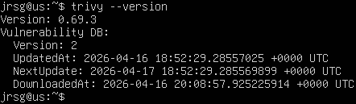

#### On GitHub, create a Personal Access Token (PAT) with `write:packages` permissions.
Let’s create a classic token on GitHub. To do this, go to your GitHub page > Settings > Developer Settings > Personal access tokens > Tokens (classic).

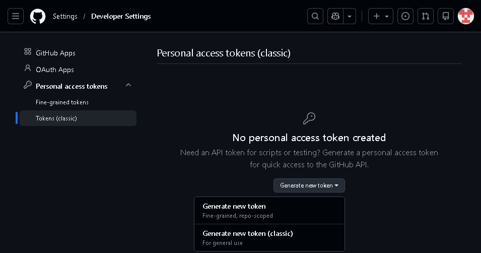

We give it a name, set an expiry date, tick the `write:packages` box and generate the token:

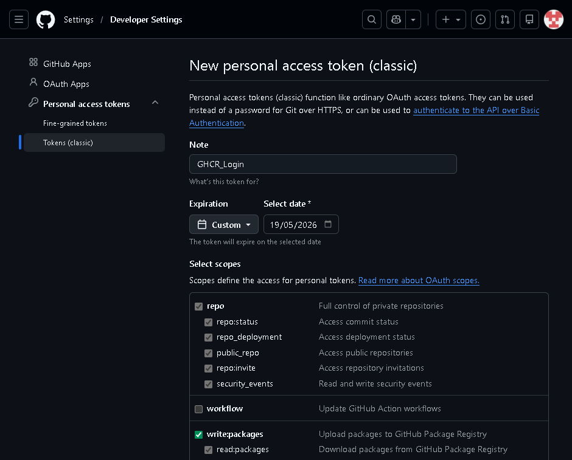

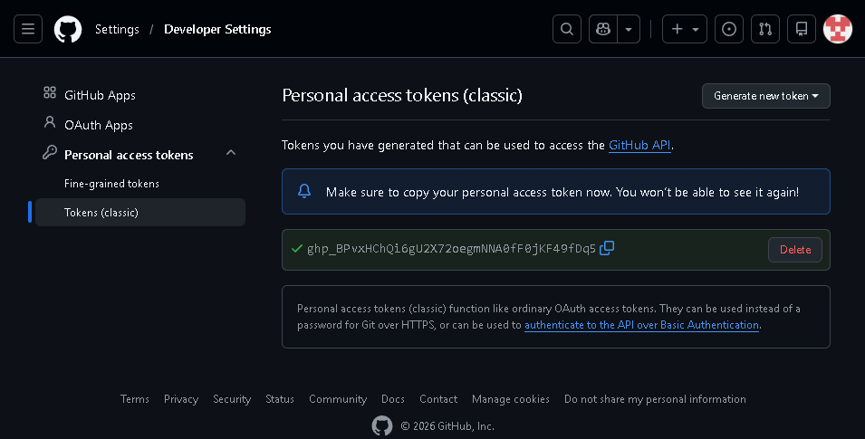

#### In your terminal, log in: `echo $CR_PAT | docker login ghcr.io -u YOUR_USERNAME --password-stdin`.
We store the token in a temporary variable so as not to leave it in the history, then we log in:

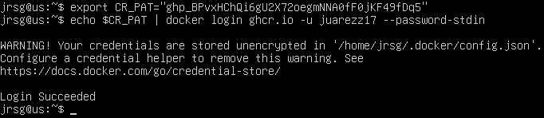

### Manual Tagging and Pushing:
#### Tag your Flask image from yesterday: `docker tag my_flask_app ghcr.io/your_username/my_flask_app:v1.0.0`.
#### Push it: `docker push ghcr.io/your_username/my_flask_app:v1.0.0`.

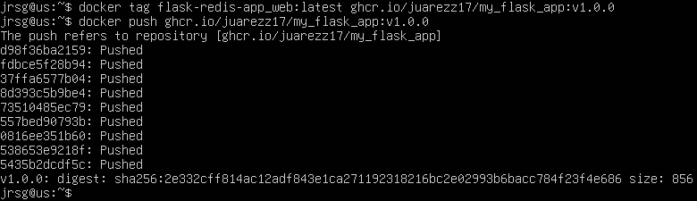

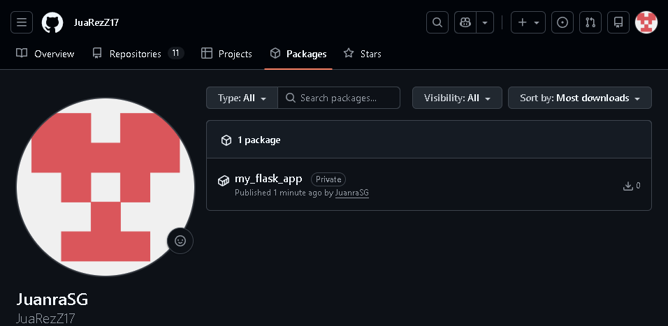

### Automation (The DevOps Challenge):
#### Go to the `.git/hooks/` folder in your code repository.

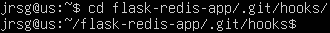

#### Create a script called `pre-push` (make it executable with `chmod +x`).

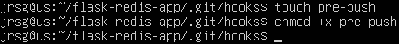

#### Script logic: The Bash script must run `trivy image --severity CRITICAL --exit-code 1 your_local_image`.

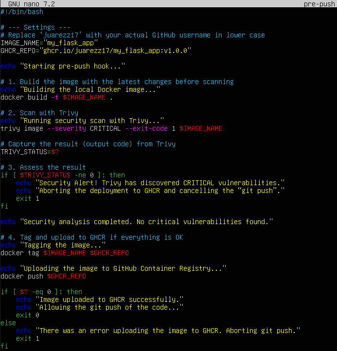

The most important lines in this script are:
- **`docker build -t $IMAGE_NAME .`:** Builds a new image of the code incorporating the latest changes. This ensures you never deploy new code containing old vulnerabilities.

- **`trivy image --severity CRITICAL --exit-code 1 $IMAGE_NAME`:** This is the most important line in the entire pipeline:
    - **`--severity CRITICAL`:** We tell Trivy to ignore minor warnings and only alert us to serious security vulnerabilities (critical level).
    - **`--exit-code 1`:** This is the magic of automation. By default, Trivy simply prints a report to the screen and exits ‘successfully’ (code 0). By setting `--exit-code 1`, we force Trivy to fail and return a technical error (code 1) to the system if it finds anything critical.

- **`docker push $GHCR_REPO / exit 0`:** If the script survives this far, it means Trivy found nothing critical:
    - We push the validated image to GitHub Container Registry.
    - Finally, we run exit 0. This tells Git: ‘Everything is perfect, you can proceed to push the code to GitHub’.

#### If Trivy finds anything critical, it returns an exit code of 1 (the script fails and the `git push` is aborted). If it passes the test, it performs `docker build`, `docker tag`, `docker push` and finally allows the `git push` of the code.

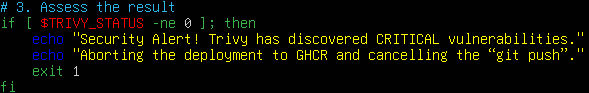

- **`TRIVY_STATUS=$? /if [ $TRIVY_STATUS -ne 0 ]; then / ... / exit 1 / fi`:** This is where we control the destination of your git push:
    - **`$?`:** This is a special Bash variable that stores the result (exit code) of the last command executed (in this case, Trivy). 0 means success; any other number means an error.
    - **`exit 1`:** If Trivy returned an error, we execute `exit 1`. When a Git hook receives an `exit 1`, Git assumes that something went wrong and cancels the push. Your faulty code never leaves your computer.