# Kind and Distribution

## Objetive
Put the simulators aside and get your hands dirty. Set up a local cluster and deploy the Week 3 app.

### Install Kind (Kubernetes in Docker). It’s the standard tool these days for quick local labs.
To install `kind`, we will download the stable version for Linux, grant it execute permissions, install it in `/usr/local/bind/`, and verify that it has been installed correctly:

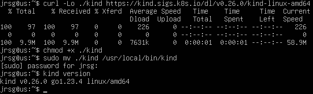

### Create a `kind-config.yaml` file and deploy a cluster with 1 Control Plane and 2 Worker Nodes: `kind create cluster --config kind-config.yaml`.

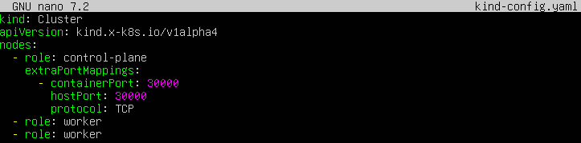

- **`role: control-plane` and `role: worker`:** These tell Kind exactly what type of node to spin up.

- **`extraPortMappings`:** This is a necessary ‘workaround’ in Kind. As Kind runs inside Docker, we need to expose the container (node) port to your actual machine (localhost) so that the browser can see it.

Once the YAML file has been created, we create the cluster:

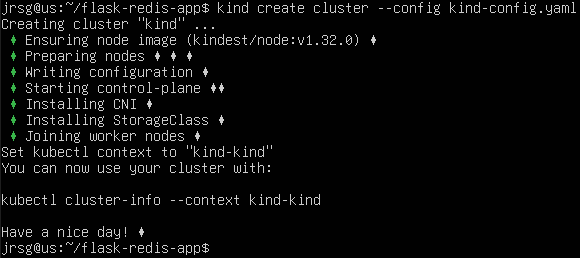

### Take your Flask + Redis app from last week. Create a deployment for Redis. 
Kubernetes usually downloads images from the internet (Docker Hub). As your Flask image is local, the Kind cluster won’t be able to find it. You need to build it (`docker build -t my-flask-app:latest .`) and “load” it into Kind:

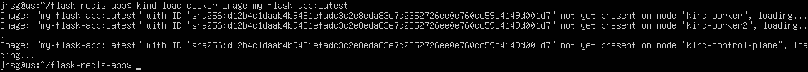

Now let’s create the deployment:

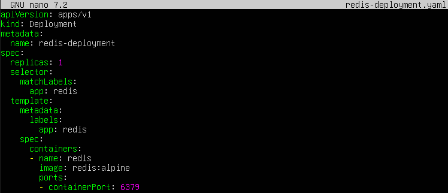

- **`image: redis:alpine`** (downloads the official lightweight version of Redis) and **`containerPort: 6379`** (the standard Redis port).

#### Create a service (ClusterIP) for Redis called redis-service.

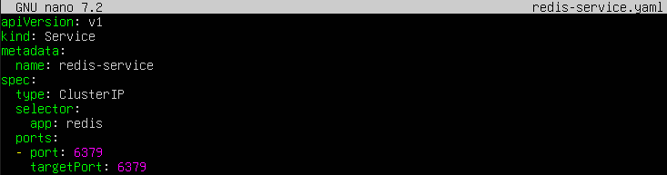

- **`name: redis-service`:** In Kubernetes, the service name becomes an internal DNS domain. This means the Flask app will be able to find it using just this name.
    - **`type: ClusterIP:`** This ensures that Redis is only accessible from within the cluster (for security reasons, we do not want to expose the database to the outside world).

#### Create a deployment for Flask. Pass the Redis URL as an environment variable (REDIS_HOST=redis-service).

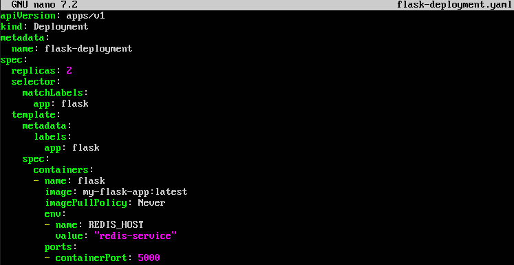

- **`imagePullPolicy: Never`:** This tells Kubernetes, ‘Don’t search the internet; use the local image I uploaded using Kind’.
    - **`env`:** Here we inject the `REDIS_HOST` variable with the value `redis-service` (the name of the internal DNS we created in the previous step).

#### Create a service (NodePort) for Flask so you can access it from your browser.

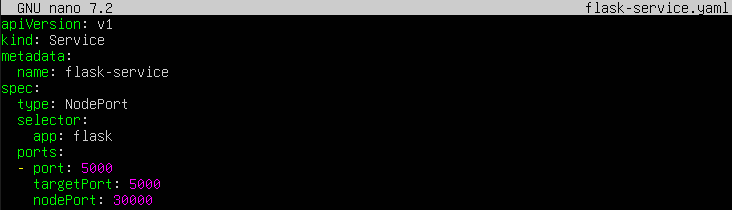

- **`type: NodePort`:** Opens a port on the physical nodes (in this case, the Docker containers) so that we can access them from outside.
    - **`nodePort: 30000`:** We force it to be exactly port 30000, so that it matches what we configured in step 2.

### Apply all the YAML files and check that the app counts visits correctly whilst distributing the load.
We apply all the files to the cluster and check that the pods have been created correctly:

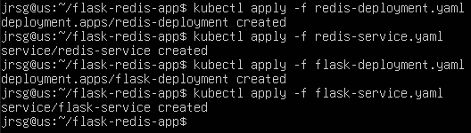

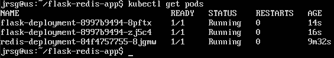

As a final check, we run `curl` to port 30000 on localhost several times to see if the visitor counter increases:

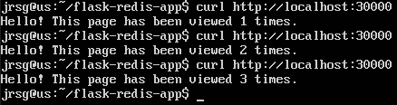
