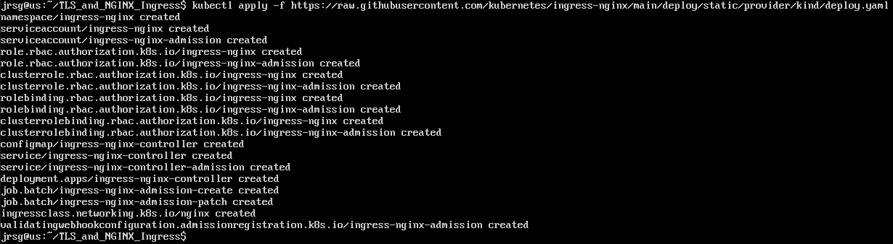
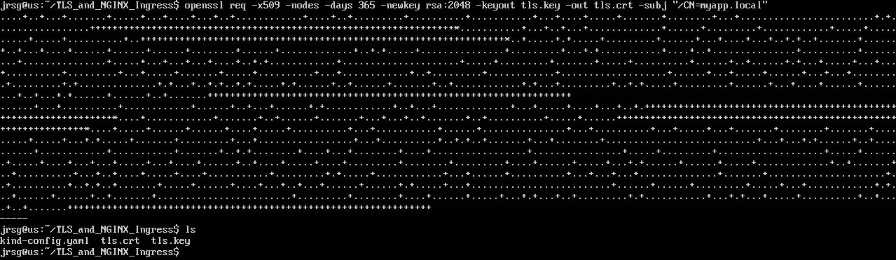
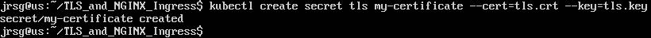
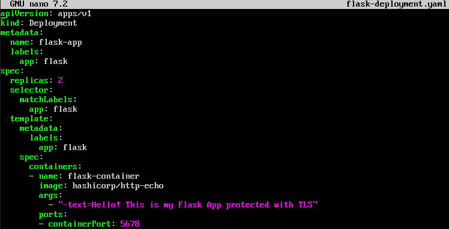
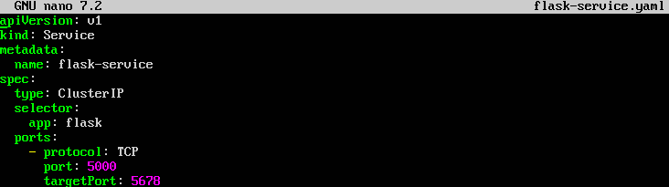
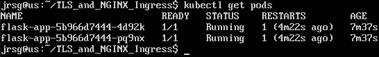
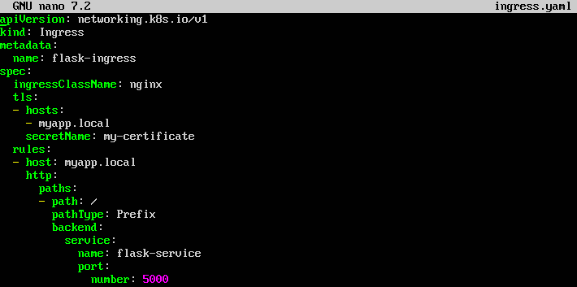
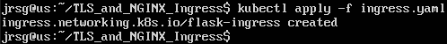
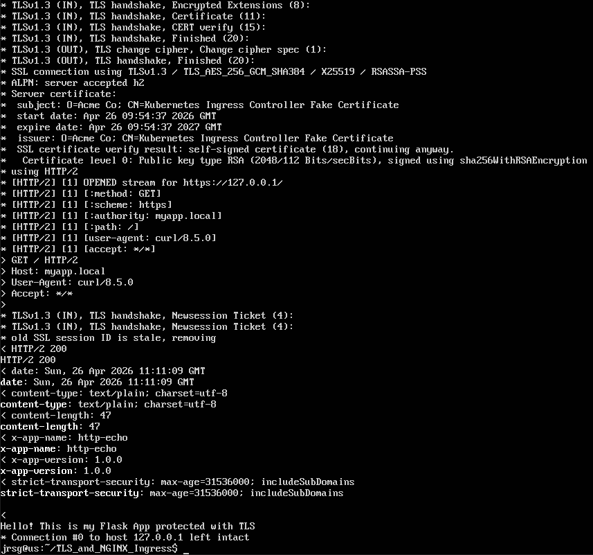

# TLS y Nginx Ingress

## Objetive
Thinking that NodePort is for beginners. In the real world, we use Ingress to expose applications via HTTP/HTTPS routes through a single load balancer.

### Install the official Nginx Ingress Controller for Kubernetes by following the documentation.
Kind comes with an official preconfigured manifest for optimally installing the Nginx driver on its clusters:

### TLS certificates:
#### Use `openssl` on your Linux system to generate a self-signed certificate (`tls.crt` and `tls.key`).

- **`-x509`:** Indicates that we want to create a certificate directly, not a signing request.

- **`-nodes`:** ‘No DES’ (no password). Prevents the certificate from prompting for a password when read.

- **`-days 365`:** The certificate will be valid for one year.

- **`-newkey rsa:2048`:** Creates a new 2048-bit RSA key at the same time.

- **`-subj ‘/CN=miapp.local’`:** Defines the Common Name of the certificate. It must match the domain you are going to use.

#### Upload these files to Kubernetes as a TLS Secret: `kubectl create secret tls my-certificate --cert=tls.crt --key=tls.key`.

This saves the certificate and private key securely within the cluster under the name `my-certificate`, so that the Ingress can use them later.

### The Ingress:
We need to have a Flask server running to carry out this exercise:

We apply the two files using `kubectl apply -f` and check that the pods have been created correctly:

#### Create an `ingress.yaml` file.

- **`ingressClassName: nginx`:** This tells Kubernetes that we want this Ingress to be managed by the controller we installed in Step 1.

#### Configure a rule so that the host `miapp.local` points to the Flask ClusterIP service.
- **`rules -> host`:** If the web request is directed to the domain `myapp.local`...

- **`backend -> service`:** ...it redirects the traffic to the `flask-service` on port `5000`.

#### Add the `tls` block referencing `my-certificate`.
- **`tls`:** Here we declare that we will use HTTPS. We specify the host (`myapp.local`) and the name of the Secret we created in Step 2 (`my-certificate`).

### Edit the `/etc/hosts` file on your host computer (outside the cluster) and add `127.0.0.1 myapp.local`.

### Open your browser and navigate to `https://myapp.local`. You will see the self-signed certificate warning (as expected); accept it, and you will be viewing your application orchestrated by Kubernetes and protected by TLS.

