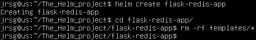
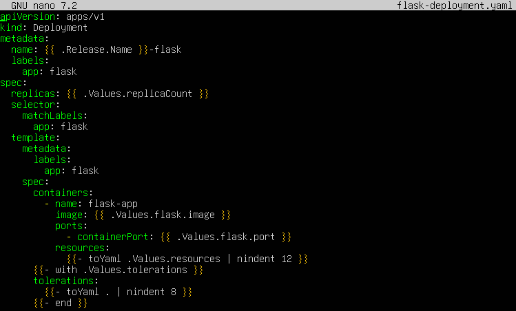
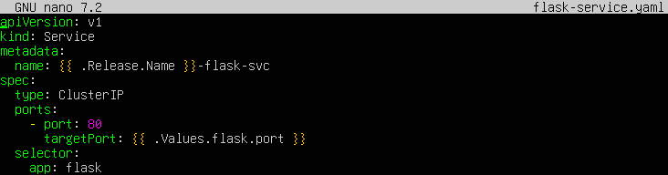
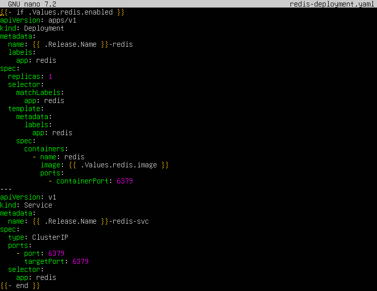
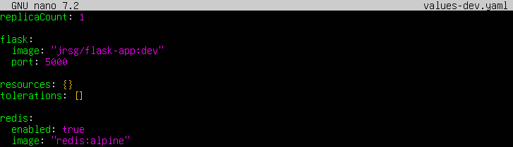
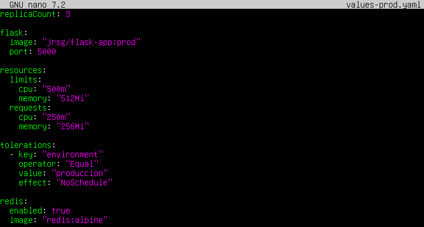

# The Helm project

## Objetive
Package your Week 3 app like a pro.

### Create a Chart that works for both your Flask app and Redis.
First, let’s create the basic structure of our chart and remove the sample files that Helm generates by default, as we’ll be building it from scratch:

### Use conditionals (`{{ if .Values.redis.enabled }}`) to decide whether to display Redis or not.
Now we’re going to create the Kubernetes manifests inside the `templates/` folder. These files will use the Go template engine to read the values we defined above:
- Flask App Deployment

- Flask App Service

- Redis Deployment and Service

The most important lines are:
- **`{{- if .Values.redis.enabled }}`** and **`{{- end }}`:** The entire Redis YAML block is enclosed within this condition. Helm reads the `redis.enabled` value from the values file. If it is `false`, Helm ignores this file entirely and does not send it to Kubernetes. The `{{-` placeholder is used to remove empty line breaks.

- **`replicas: {{ .Values.replicaCount }}`:** Dynamically sets the number of replicas. If you use `values-dev.yaml`, it will be set to 1; if you use `values-prod.yaml`, it will be set to 3.

- **`{{- toYaml .Values.resources | nindent 12 }}`:** The resources block (CPU/RAM) is a nested YAML block. `toYaml` converts whatever is in your values file into a valid YAML block, and `nindent 12` indents it exactly 12 spaces to the right so that it fits perfectly beneath the container’s `resources:` directive. If the block is empty (`{}`) in dev, it prints nothing; if it has limits in prod, it prints them correctly formatted.

- **`{{- with .Values.tolerations }}`:** The `with` function changes the scope. It means: ‘If any `tolerations` are defined, enter this block and apply them’. It is very useful for injecting advanced configurations (such as those required by production node taints) only when they are declared.

### Create two values files: `values-dev.yaml` (1 replica, no resource limits) and `values-prod.yaml` (3 replicas, with CPU/RAM limits and taints).
Instead of using the default `values.yaml`, we’re going to create the two environments in the root of the flask-redis-app directory:
- An environment with one replica, no resource limits, and Redis enabled:

- An environment with three replicas, CPU/RAM limits, Tolerations (so that Pods can be scheduled on nodes with production-specific ‘Taints’) and Redis enabled.

