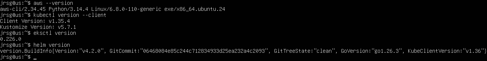
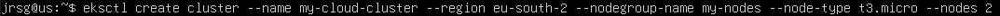
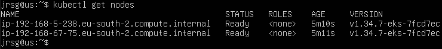
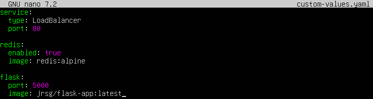
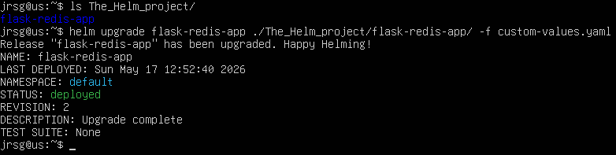
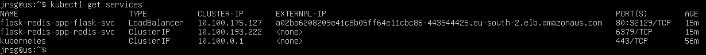
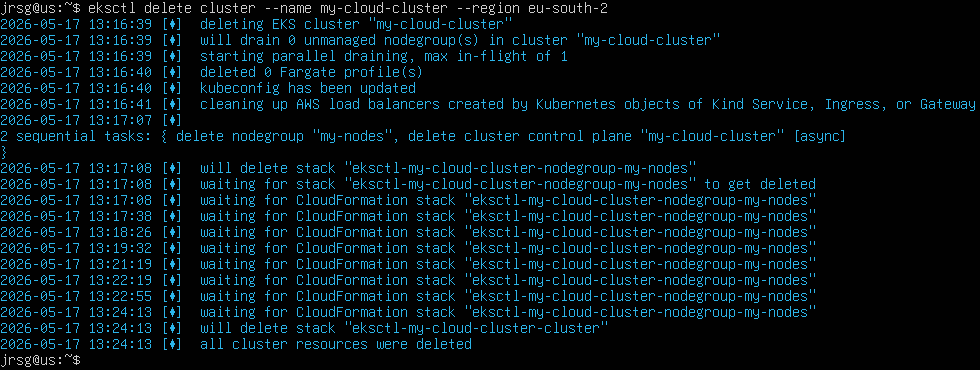

# Deployment using eksctl

## Objetive
Deploy K8s in a production cloud environment. Understand the separation of responsibilities: AWS manages the control plane and you manage the nodes (data plane).

### Install eksctl (the official CLI for managing EKS clusters) and kubectl.
To install eksctl, download the official Linux version, extract the binary and move it to the path:
```
curl -sLO ‘https://github.com/eksctl-io/eksctl/releases/latest/download/eksctl_Linux_amd64.tar.gz’
tar -xzf eksctl_Linux_amd64.tar.gz -C /tmp && rm eksctl_Linux_amd64.tar.gz
sudo mv /tmp/eksctl /usr/local/bin
```
Now check that you have all the tools required to complete the exercise:



### Launch a minimal cluster with 2 managed nodes. This will automatically create the necessary VPC, subnets and IAM roles (takes around 15–20 minutes):
```
eksctl create cluster --name my-cloud-cluster --region eu-south-2 --nodegroup-name my-nodes --node-type t3.micro --nodes 2
```



### Check that your local kubectl has configured itself: kubectl get nodes.



### Change your application’s service from NodePort to LoadBalancer. AWS will detect this K8s object and create a real physical load balancer in your account pointing to your pods.
Let’s create the `custom-values.yaml` file, which will contain the configuration for our original application:



### Deploy the Helm-packaged notes web application (Flask + Redis) that you built in Week 5.
As the application was already installed in week 5, instead of using `helm install`, we will use `helm upgrade`:





### CRITICAL CLEAN-UP (Do not skip):
```
eksctl delete cluster --name my-cloud-cluster --region eu-west-1
````

