# AWS Foundation Module

## Objetive
The culmination of your IaC portfolio. Turn your Week 6 clicks into professional, modularised and versioned code.

### Enter the code for your VPC, 2 public subnets, 2 private subnets, an Internet Gateway and route tables.
First, we create a folder for the project (`aws-base-module`) and inside it we create the `provider.tf` file to tell Terraform that we will be connecting to AWS:

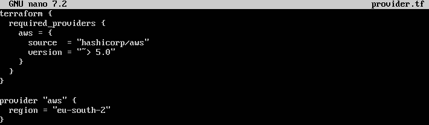

Now we create the `network.tf` file with the VPC, the Internet Gateway, 2 public subnets and 2 private subnets, along with their routing tables:

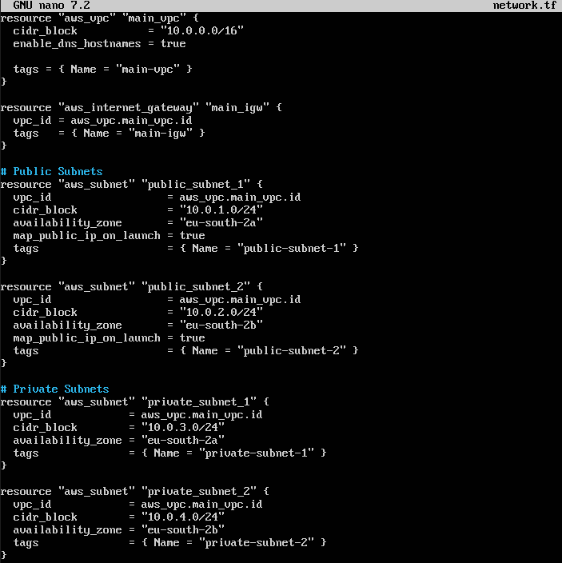

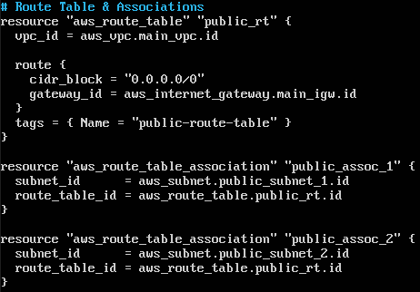

Key lines:
- **`enable_dns_hostnames = true`:** Essential for instances to receive valid DNS names within AWS.

- **`map_public_ip_on_launch = true`:** Ensures that any resource deployed in these public subnets automatically obtains a public IP address.

- **`route { cidr_block = ‘0.0.0.0/0’ gateway_id = aws_internet_gateway.main_igw.id }`:** This is the golden rule that turns a normal subnet into a ‘public’ one, directing all external traffic to the Internet Gateway.

### Create the necessary security groups (allow HTTP to the load balancer, and allow HTTP from the load balancer to the EC2 instances).
We will create two Security Groups. The first allows the entire world to access the Load Balancer. The second ensures that the EC2 instances only accept traffic if it comes from the Load Balancer:

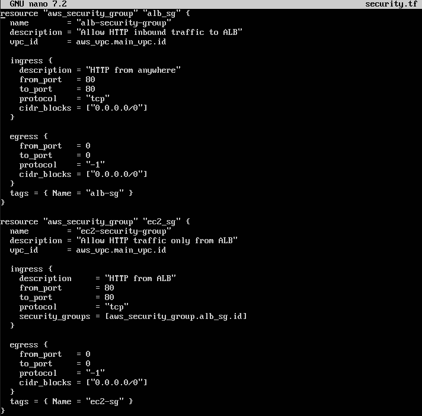

Key lines:
- **`security_groups = [aws_security_group.alb_sg.id]`:** This is the magic of security in AWS. Instead of opening up IP addresses, we tell the EC2 instances: ‘Only trust traffic that is marked by the load balancer’s Security Group’.

- **`protocol = ‘-1’`** in **`egress`:** Allows all outbound traffic (necessary for the machines to download updates and packages).

### Write the aws_launch_template, the aws_autoscaling_group and the aws_lb (Application Load Balancer).
We create the Load Balancer (ALB), the Target Group, the Launch Template and the Auto Scaling Group:

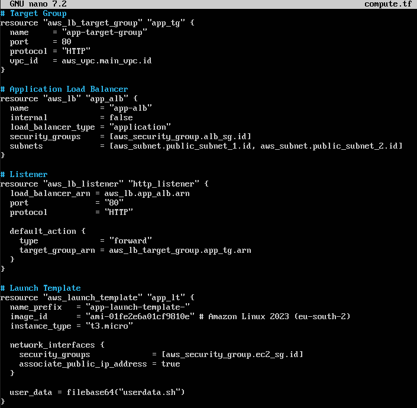

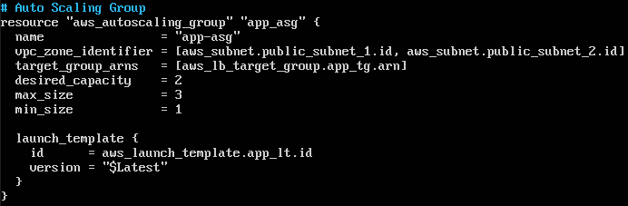

Key lines:
- **`subnets = [...]`** in the **`aws_lb`:** An internet-facing load balancer must always be located in public subnets.

- **`user_data = filebase64(‘userdata.sh’)`:** Terraform reads the external file userdata.sh, encodes it in base64 (an AWS API requirement) and injects it cleanly into the Launch Template.

- **`target_group_arns = [...]`** in the **`aws_autoscaling_group`:** This connects the Auto Scaling Group to the Load Balancer. Whenever the ASG creates a new instance, it automatically registers it in this Target Group so that it can start receiving traffic.

### Pass a Bash script via the Launch Template’s user_data property to install the web server.
We create a Bash script that Terraform will inject into the machines when they are provisioned. It will install an Apache web server and create a simple HTML page displaying the machine’s hostname:

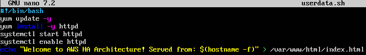

Key lines:

- **`#!/bin/bash`:** Tells the operating system to run this file as a Bash script. It must be the first line.

- **`$(hostname -f)`:** In an environment with multiple instances, this will allow you to refresh the web page and see the text change, visually demonstrating that the load balancer is sending traffic to different machines.

### With a single command (`terraform apply -auto-approve`), you should be able to set up an entire high-availability architecture on AWS in under 3 minutes. Once testing is complete, destroy everything with terraform destroy.
To avoid having to go to the AWS console to find the load balancer’s URL, we’re going to create this final file, `outputs.tf`:

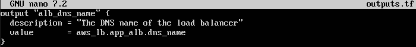

We run `terraform init` and `terraform apply`:

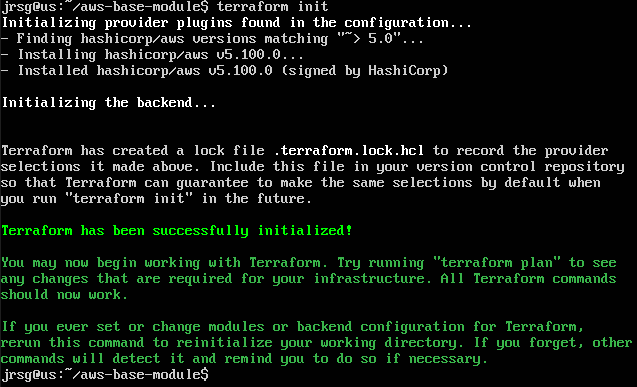

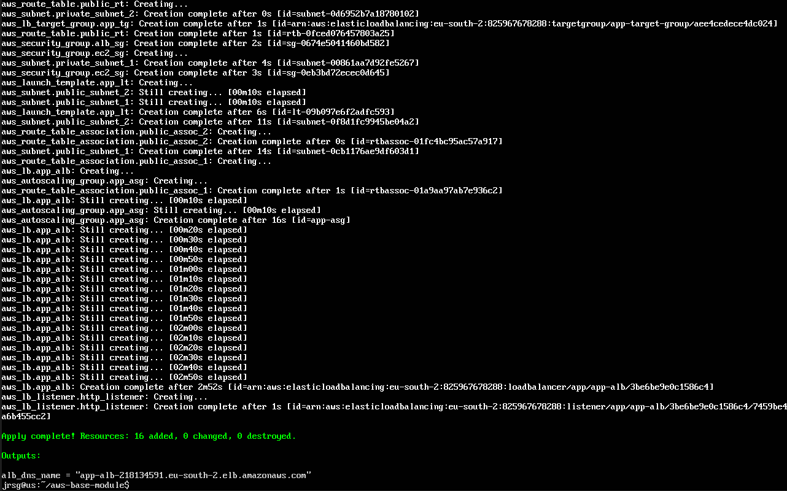

To check that everything is working correctly, let’s enter the address returned by `terraform apply` into our browser:

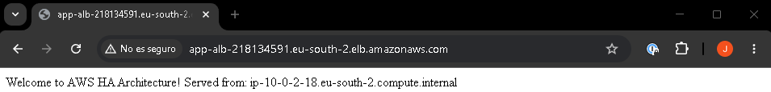

In the image above, we can see our web server working perfectly:

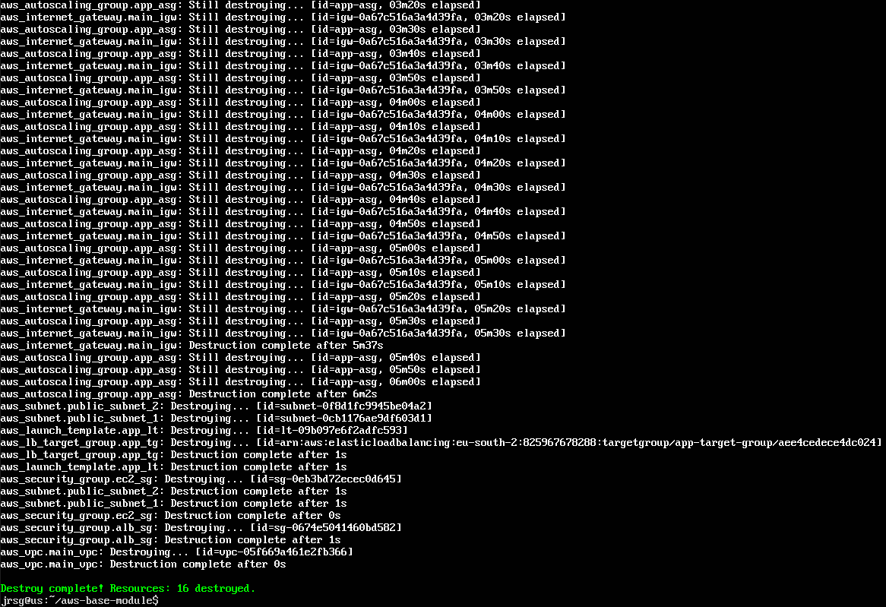