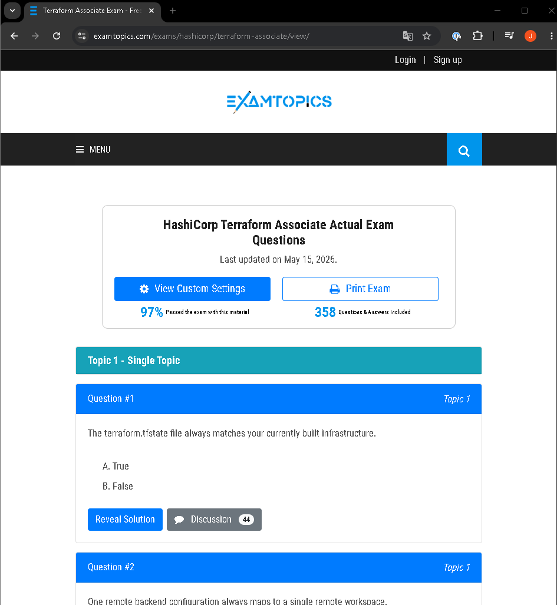

# Terraform Associate Certification

## Objetive
Put what you’ve learnt to good use by preparing for the official certification, which is a great way to boost your CV.

### Workspaces
They allow you to manage multiple environments using exactly the same `.tf` code. The magic lies in the fact that each workspace maintains its own independent state file. The main commands are:
- **`terraform workspace list`:** Displays all available environments. The current one will be marked with an asterisk (`*`).

- **`terraform workspace new <name>`:** Creates a new environment and switches you to it automatically.

- **`terraform workspace select <name>`:** Switches from one environment to another.

- **`terraform workspace show`:** Tells you which environment you are currently in.

Terraform exposes a special variable called `terraform.workspace`. Workspaces are great for environments that are architecturally identical. If your `prod` environment has replicated databases, complex load balancers and separate subnets, whilst `dev` is just a single machine, it is better to separate the code into different directories rather than using workspaces to avoid code full of `if/else` conditions.

### Terraform State Commands
The state file (`terraform.tfstate`) is sacred. You should never edit it manually. To modify it without breaking anything, Terraform provides the `terraform state` tool. The most important commands are:
- **`terraform state list`:** Displays a list of all the resources that Terraform is currently managing in your state.

- **`terraform state mv`:** Allows you to rename a resource in your .tf code without Terraform destroying and recreating it.

- **`terraform state rm`:** Removes the resource from the Terraform state file, but does not destroy the actual infrastructure in the cloud.

### Taint (Forced recreation)
Sometimes, the actual infrastructure breaks in a way that Terraform cannot detect, and you have to delete everything and rebuild it. Previously, we used `terraform taint aws_instance.web`. This marked the resource as ‘tainted’ in the state. The problem is that if you forgot to run `apply` afterwards, or if another team member ran `apply`, the resource would be unexpectedly destroyed. Since Terraform 0.15+, the `taint` command is deprecated. Now the replacement command is issued at the very moment you apply the changes, making the process much safer and more predictable (`terraform apply -replace=‘aws_instance.web’`). This means that:
- Terraform will schedule the destruction of `aws_instance.web`.

- It will plan the creation of a new `aws_instance.web`.

- It will ask for your confirmation (just like a normal `apply`).

- If you accept, it will execute the replacement immediately. No residual ‘taint marks’ remain in the state if you decide to cancel.

### Take free online practice tests for Terraform Associate Certification

