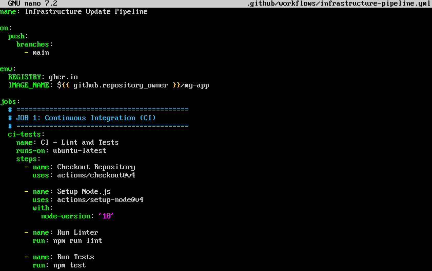
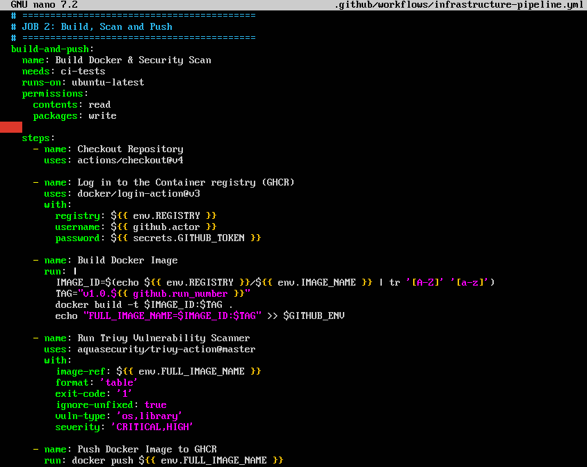
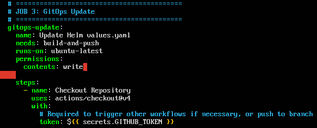
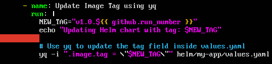
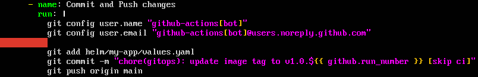

# Infrastructure Update Pipeline

## Objective
Integrating GitHub Actions with your Helm Chart (Week 5). This is the pattern known as ‘Poor Man’s GitOps’, the operational foundation before installing complex tools such as ArgoCD.

### **Job 1 (CI):** Runs the linter and tests.

- **`uses: actions/checkout@v4`:** Downloads the source code to the virtual server (Runner) where the pipeline is running, so that it can read `package.json` and run the tests.

### **Job 2 (Build):** If CI passes, it builds the Docker image, scans it with Trivy, and pushes it to GHCR with a dynamic tag (e.g. `v1.0.${{ github.run_number }}`).

- **`needs: ci-tests`:** Tells GitHub Actions not to run this job until the ci-tests job has finished successfully. If the linter or tests fail, the build is cancelled.

- **`password: ${{ secrets.GITHUB_TOKEN }}`:** GitHub automatically injects this temporary token to authenticate you against GitHub Container Registry (GHCR).

- **`IMAGE_ID=$(echo ... | tr “[A-Z]” '[a-z]')`:** GHCR requires repository names to be in lowercase. This converts your username to lowercase if it contains uppercase letters (e.g. MyUser -> myuser).

- **`TAG=‘v1.0.${{ github.run_number }}’`:** Here we generate the dynamic tag. github.run_number is a native variable that increments by 1 each time the pipeline runs (1, 2, 3...).

- **`exit-code: “1” (In Trivy)`:** If Trivy finds CRITICAL or HIGH vulnerabilities, it will return an exit code of 1, which will cause the pipeline to fail and abort the operation. The image will not be uploaded to GHCR if it is insecure.

### **Job 3 (GitOps Update):** Checks out the repository where you store your **Helm Chart**.

- **`permissions: contents: write`:** Grants the GitHub token write permissions for the repository. Without this, the `git push` command would fail, returning a 403 error.

### Uses a tool such as `yq` (the YAML version of `jq`) or `sed` to modify the `values.yaml` file, updating the `image.tag` field with the newly compiled version.

- **`yq -i ‘.image.tag = \’$NEW_TAG\‘’ helm/my-app/values.yaml`:** yq is already installed on GitHub’s Ubuntu runners. The -i (in-place) parameter overwrites the original values.yaml file. It navigates through the YAML to the image.tag property and replaces its value with the new dynamic tag.

### Performs an automated `git commit` and `git push` from the pipeline to the infrastructure repository.

- **`git config user.name ‘github-actions[bot]’`:** Sets the Git identity on the virtual machine. Without this, Git won’t let you make commits. We use the standard GitHub bot identity.

- **`[skip ci]`:** Adding this to the commit message (git commit -m ‘... [skip ci]’) is crucial. When you git push to main, GitHub would detect a new push and re-run the entire pipeline, creating an infinite loop. [skip ci] tells GitHub to ignore this commit.