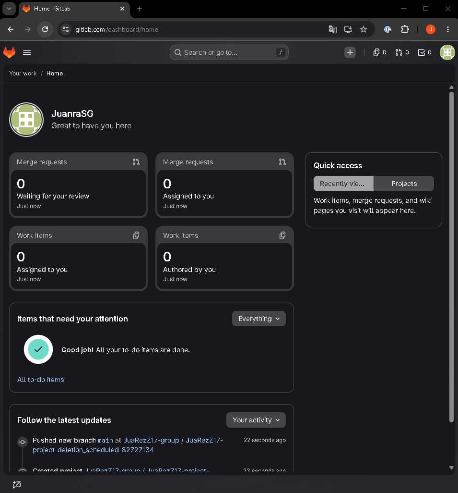
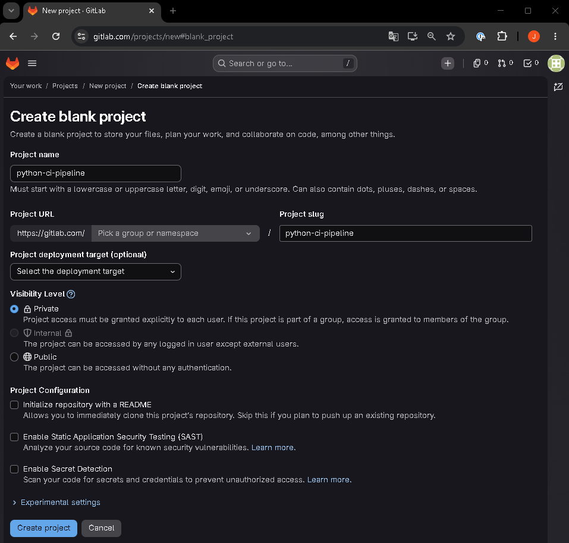
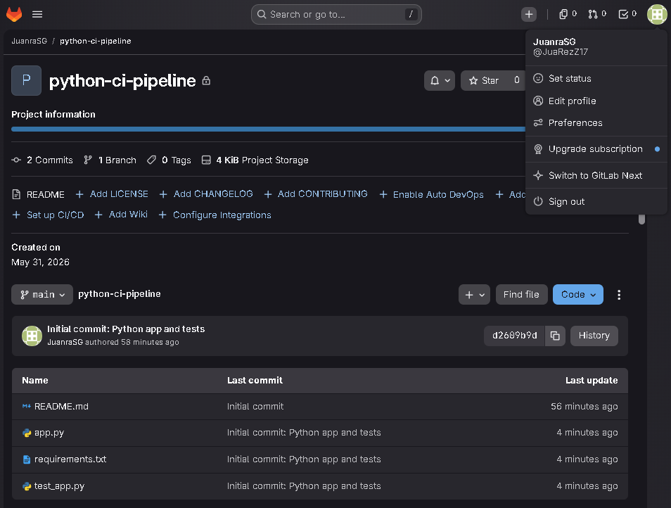
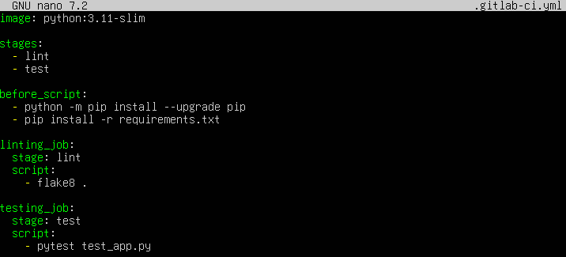
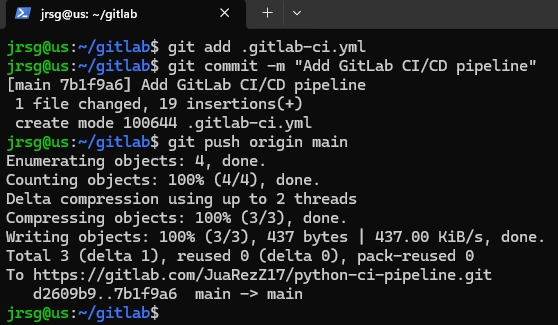
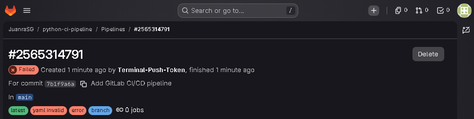

# Translation of Syntax

## Objective
Expand your skillset. Whilst GitHub Actions leads the open-source market, GitLab CI/CD is extremely dominant in enterprise and corporate environments.

### Study how GitLab uses `.gitlab-ci.yml`. Learn about `stages` (as opposed to GitHub’s explicit `needs` dependency) and the powerful architecture of isolated **GitLab Runners**.
The `.gitlab-ci.yml` file is at the heart of automation in GitLab. It is a declarative file written in YAML format that must be located in the root of the repository. Unlike GitHub Actions, which typically splits its workflows across multiple files within the `.github/workflows/` directory, GitLab centralises all application lifecycle configuration in this single file by default. Each main block in the file defines a job, which contains the commands to be executed, or a global configuration (such as defining variables, base images or global scripts). The fundamental difference in orchestration between the two tools lies in how they manage the flow and dependencies between tasks:
- **GitHub Actions (`needs` by default):** In GHA, all jobs run independently and in parallel by default. If you need one job to wait for another to finish, you must explicitly declare a linear or network dependency using the `needs` keyword. Its natural model is a Directed Acyclic Graph (DAG).

- **GitLab CI/CD (default `stages`):** GitLab organises the execution using a rigid but secure model of linear stages (`stages`). You define an ordered list of stages in the header of the file. Each job is assigned to a specific stage using the `stage: stage_name` property. All jobs assigned to the same stage run simultaneously, provided there are enough runners available. GitLab operates with strict sequential blocking. No jobs in the `test` stage will start until all jobs in the `build` stage have finished successfully. If a single job fails, the pipeline stops completely and subsequent stages (such as `deploy`) are cancelled.

A GitLab Runner is a lightweight, open-source application written in Go that is installed on a computing environment and is responsible for processing pipeline jobs. The GitLab server does not run your code; it merely acts as the orchestrating brain.

### Create a free account on GitLab.com, upload your Python application code.

### Rewrite Wednesday’s pipeline (Linting + Tests) using GitLab CI syntax.

- **`image: python:3.11-slim`:** This is the magic of GitLab Runners. Instead of setting up the environment step by step, you tell the Runner to launch a native Docker container with Python 3.11 pre-installed. Everything that happens in your pipeline will run within this isolated environment.

- **`stages:`:** Here you define the execution order. In GitLab, all jobs within the same stage run in parallel, and the pipeline only moves on to the next stage if the previous one was successful. This replaces the need to use `needs`, as in GitHub Actions, for basic sequential flows. It will first run `lint` and, if that passes, it will run `test`.

- **`before_script:`:** These are commands that will run before the `script` block in each of the jobs. It’s extremely useful to avoid repeating the installation of dependencies (`pip install -r requirements.txt`) in the linting job and then again in the testing job.

- **`stage: lint / stage: test`:** Within each job (`linting_job` and `testing_job`), this label tells GitLab which stage the job belongs to, determining its order of execution.

- **`script:`:** This is the heart of the job. This is where you put the actual Bash commands you want the Runner to execute.

### Push your changes and view the run in the GitLab CI/CD menu.

