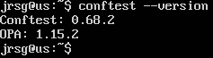
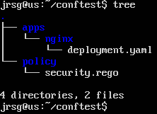
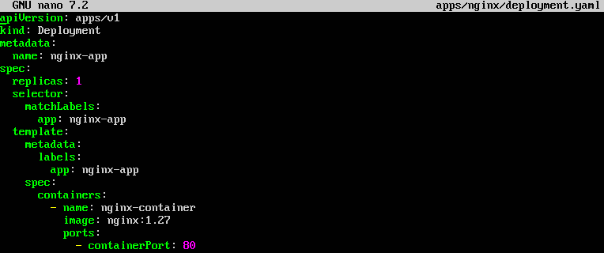
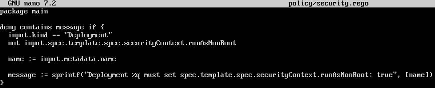
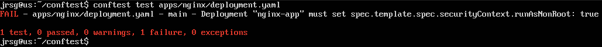

# Policy-as-Code with OPA

## Objective
Add governance and security. Ensure that no pipeline or developer can deploy insecure configurations (such as containers running as root or services accidentally left exposed) by validating policies as if they were code before applying them.

### Policy-as-Code (PaC)
It involves defining policies, standards or compliance rules via code or configuration files, rather than relying solely on manual reviews, PDF documents or human checks. The main idea is that security, compliance or governance rules can be: versioned in Git, reviewed via pull requests, tested automatically, executed in CI/CD pipelines and applied in Kubernetes, Terraform, APIs, microservices, etc.

### OPA (Open Policy Agent) and Rego
It is an open-source, general-purpose policy engine. Its purpose is to separate policy decision logic from the main code of an application or system. Rather than embedding permission, security or compliance rules within the application code, these decisions are delegated to OPA. OPA receives input data, typically in a structured format such as JSON, evaluates that data against policies written in Rego, and returns a decision.

Rego is the declarative language used by OPA to write policies. It is a language specifically designed to evaluate policies on structured data such as JSON, YAML or infrastructure configurations. OPA uses Rego to reason about data such as API requests, infrastructure-as-code files or system configurations. The key feature of Rego is that it is declarative. This means that in Rego, you define which condition must be met, rather than specifying step-by-step how the algorithm should be executed.

### Exercise 1: Install conftest (a widely used OPA-based tool for validating local YAML/JSON files).
To install confest on Ubuntu Server, follow these steps:
1. Update packages and install dependencies:
```
sudo apt update
sudo apt install -y wget tar
```

2. Install confest using the official method for Linux:
```
LATEST_VERSION=$(wget -O - ‘https://api.github.com/repos/open-policy-agent/conftest/releases/latest’ | grep ““tag_name”:” | sed -E “s/.*‘([^’]+)".*/\1/” | cut -c 2-)

ARCH=$(arch)
SYSTEM=$(uname)

wget ‘https://github.com/open-policy-agent/conftest/releases/download/v${LATEST_VERSION}/conftest_${LATEST_VERSION}_${SYSTEM}_${ARCH}.tar.gz’

tar xzf conftest_${LATEST_VERSION}_${SYSTEM}_${ARCH}.tar.gz

sudo mv conftest /usr/local/bin/
```

3. Check that it has been installed correctly:



### Exercise 2: Create a policy/security.rego file. Write a policy that analyses YAML files and returns an error if it finds a Kubernetes Deployment that does not have the securityContext.runAsNonRoot: true block configured.
We create the directory and file structure:





- **`kind: Deployment`:** Indicates that this manifest defines a Kubernetes Deployment.


- **`metadata:
  name: nginx-app`:** Name of the Deployment.

- **`spec:
  template:
    spec:
      containers`:** Defines the Pod template that the Deployment will create.

The problem is that this block is missing:

```
securityContext:
  runAsNonRoot: true
```

That is why our policy must fail.



- **`package main`:** Defines the main package. By default, Conftest looks for rules in the `package main`.

- **`deny contains message if {`:** Creates a deny rule. If the condition is met, Conftest will display an error.

- **`input.kind == ‘Deployment’`:** We only apply this rule if the YAML file is a Kubernetes Deployment.

- **`not input.spec.template.spec.securityContext.runAsNonRoot`:** Checks that this does not exist or is not enabled:

- **`securityContext:
  runAsNonRoot: true`:** In other words, if the Deployment does not require the container to run as a non-root user, the policy fails.

- **`name := input.metadata.name`:** Stores the name of the Deployment in a variable called name.

- **`message := sprintf(...)`:** Creates the error message that will appear when running conftest.

### Exercise 3: Run conftest test apps/nginx/deployment.yaml.



This means that conftest has read the YAML, converted it into input data for OPA, and evaluated the Rego policy against that content. OPA works with structured data and evaluates policies to produce decisions, not just ‘allow’ or ‘deny’ responses.