# The Automated Cloud-Native Stack

## Objective
The perfect finishing touch for your deployment architecture. Automate infrastructure provisioning with Terraform and application deployment with ArgoCD via Git.

### Write the Terraform code to provision an EKS cluster (Week 6/7), but add a `helm_release` block so that Terraform automatically installs ArgoCD within the cluster as soon as it is created.
First, let’s set up the folder structure:

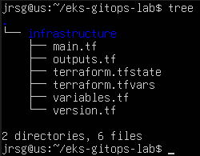

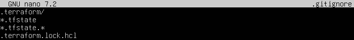

- **`*.tfstate`:** Prevents the Terraform state from being uploaded to GitHub.

- **`.terraform/`:** Prevents dependencies downloaded by Terraform from being uploaded.

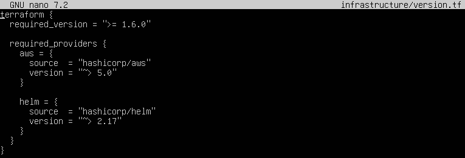

- **`aws = {source  = ‘hashicorp/aws’}`:** Allows you to create resources on AWS.

- **`helm = {source  = ‘hashicorp/helm’}`:** Allows Terraform to install ArgoCD using Helm.

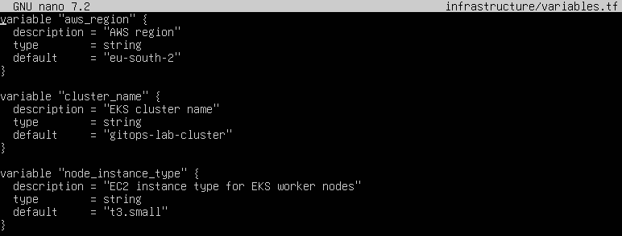

- **`default = ‘eu-south-2’`:** Uses Ireland. You can change this if you wish.

- **`default = ‘t3.small’`:** A basic instance to ensure EKS and ArgoCD run without running out of memory.

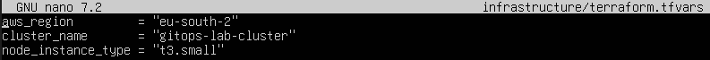

- **`module ‘vpc’`:** Creates the AWS network: VPC, public and private subnets.

- **`enable_nat_gateway = true \ single_nat_gateway = true`:** Allows private nodes to download images from the internet.

- **`module ‘eks’`:** Creates the EKS cluster.

- **`cluster_version = ‘1.35’`:** Uses Kubernetes 1.35, currently available on EKS according to AWS documentation.

- **`eks_managed_node_groups`:** Creates the EC2 node group that will run the pods.

- **`provider ‘helm’`:** Connects Terraform to the EKS Kubernetes cluster.

- **`resource ‘helm_release’ ‘argocd’`:** Automatically installs ArgoCD within the cluster immediately after creating EKS.

- **`repository = ‘https://argoproj.github.io/argo-helm’`:** Uses the official Argo Helm repository.

- **`server.service.type = ‘ClusterIP’`:** ArgoCD remains within the cluster. We will expose it via port forwarding.

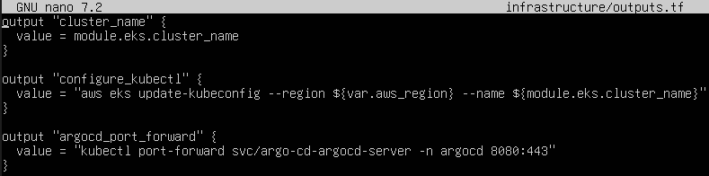

- **`configure_kubectl`:** Provides the command to connect kubectl to EKS.

- **`argocd_port_forward`:** Provides the command to open ArgoCD locally.

Finally, we run Terraform using `terraform init` and `terraform apply`:

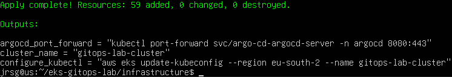

### Take your Helm chart from Week 5. Upload it to your infrastructure repository.
Let’s create the configuration files for our Helm Chart app:

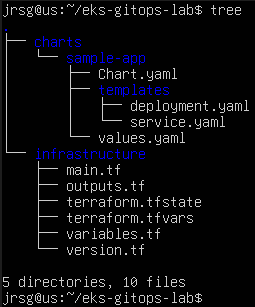

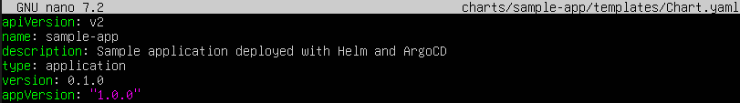

- **`name: sample-app`:** Name of the chart.

- **`version: 0.1.0`:** Version of the Helm chart.

- **`appVersion: ‘1.0.0’`:** Version of the application.

- **`replicaCount: 1`:** Creates a single pod.

- **`repository: nginx`:** Uses the Nginx image.

- **`tag: ‘1.27.5’`:** This will be the version we will later change to test GitOps.

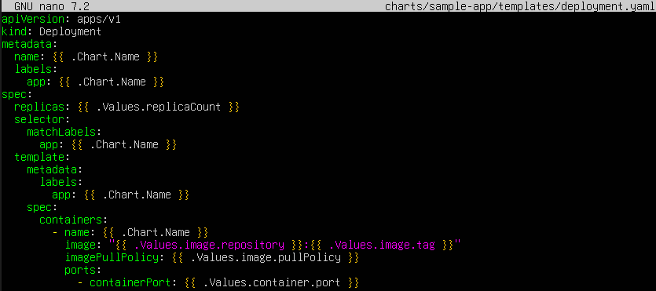

- **`replicas: {{ .Values.replicaCount }}`:** Retrieves the number of replicas from values.yaml.

- **`image: ‘{{ .Values.image.repository }}:{{ .Values.image.tag }}’`:** Builds the final image, for example:

- **`nginx:1.27.5`:** When you change the tag, ArgoCD will detect the change.

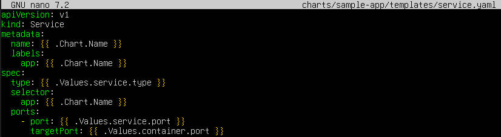

- **`type: {{ .Values.service.type }}`:** Use ClusterIP, which is sufficient for this exercise.

- **`selector: app: {{ .Chart.Name }}`:** Connects the Service to the Deployment’s pods.

We push the changes to GitHub:

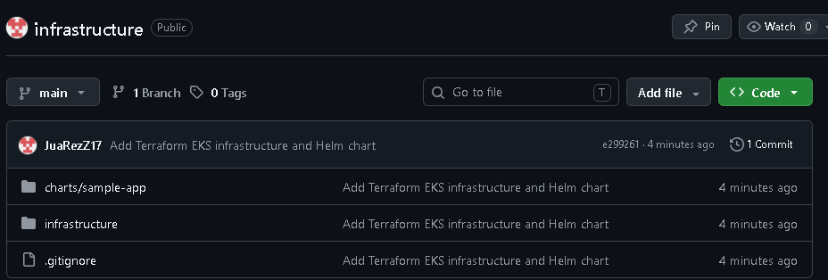

### Run `terraform apply`. AWS provision your cluster and starts ArgoCD natively. Configure an application in ArgoCD to pull your Helm Chart from GitHub. From that point onwards, disable the use of the CLI for deployment. Make a change to the values.yaml file in your Helm Chart (for example, change your application’s version tag), run `git push`, and time how long it takes for the AWS cluster to update the application in a 100% automated manner.
We run the command returned by `terraform apply` to configure kubectl:

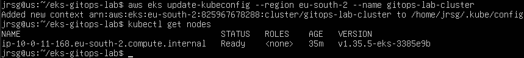

Now we access Argocd via our browser. To do this, we set up a port forwarding rule on our virtual machine and connect via SSH from our physical machine to our virtual machine:

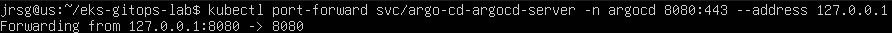

We look for the password (the username is `admin` by default):

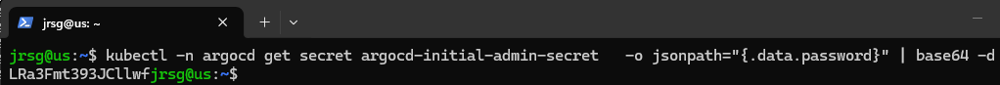

We go to `http://locahost:8080` in our browser and enter the credentials:

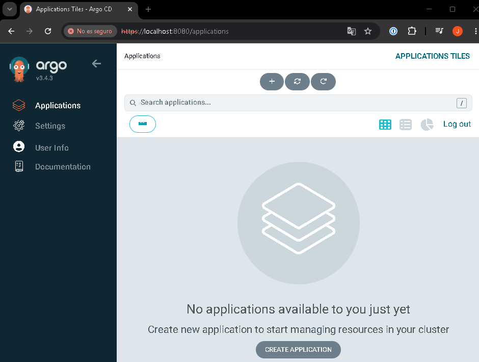

Once inside argocd, we create our app with the following configuration:

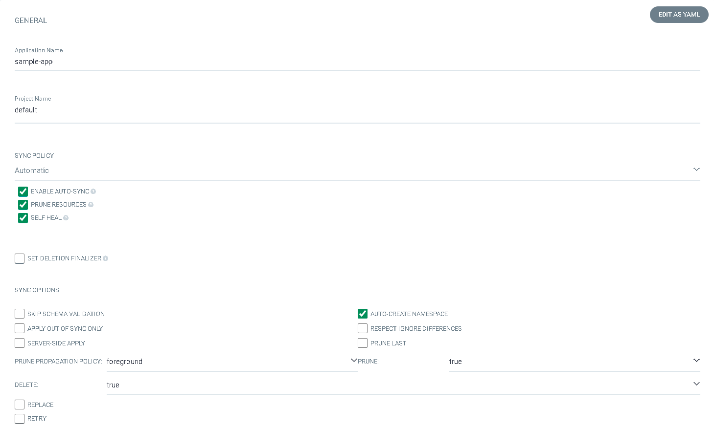

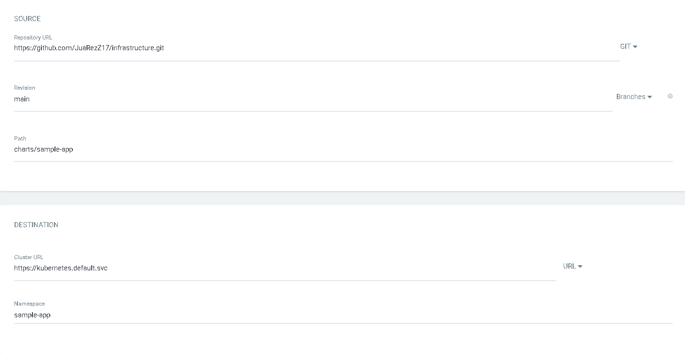

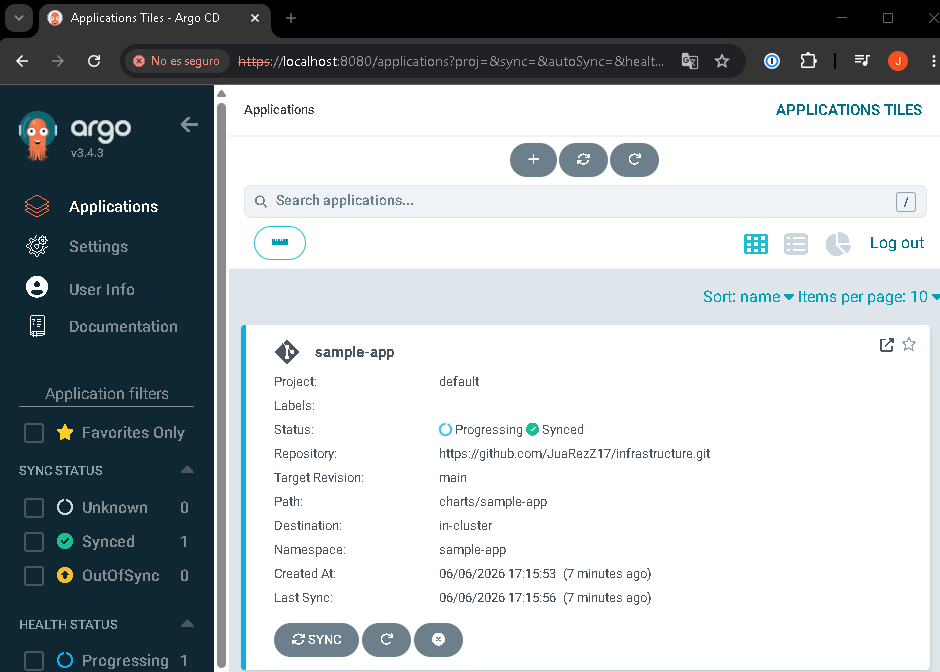

Now we modify the `values.yaml` file and push the changes to GitHub:

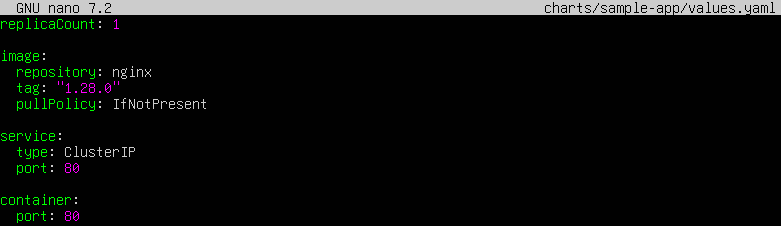

If we access the app in ArgoCD, we will see that we have two versions of it:

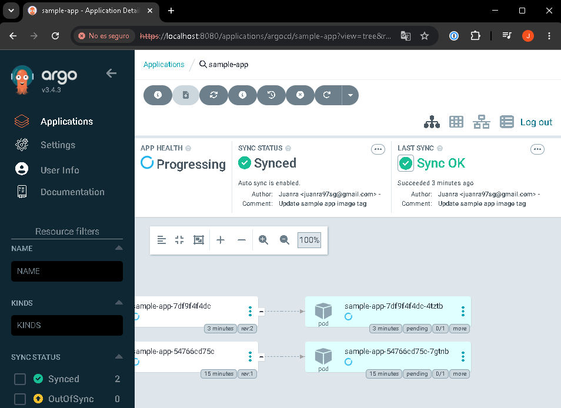

### Remember to run `terraform destroy` when finished to avoid AWS costs.
We navigate to the `infrastructure` directory and run the `terraform destroy` command:

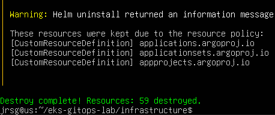