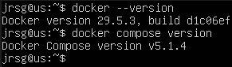
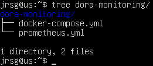
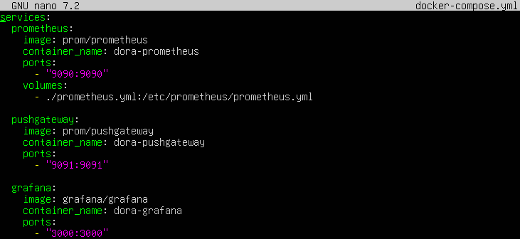
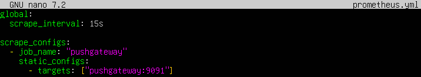
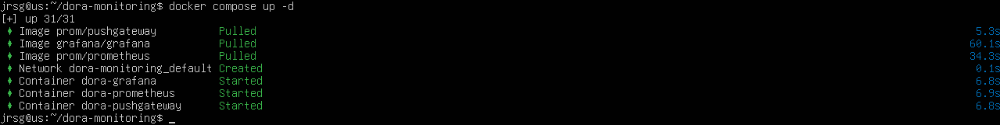
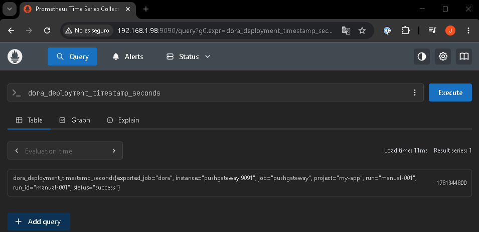
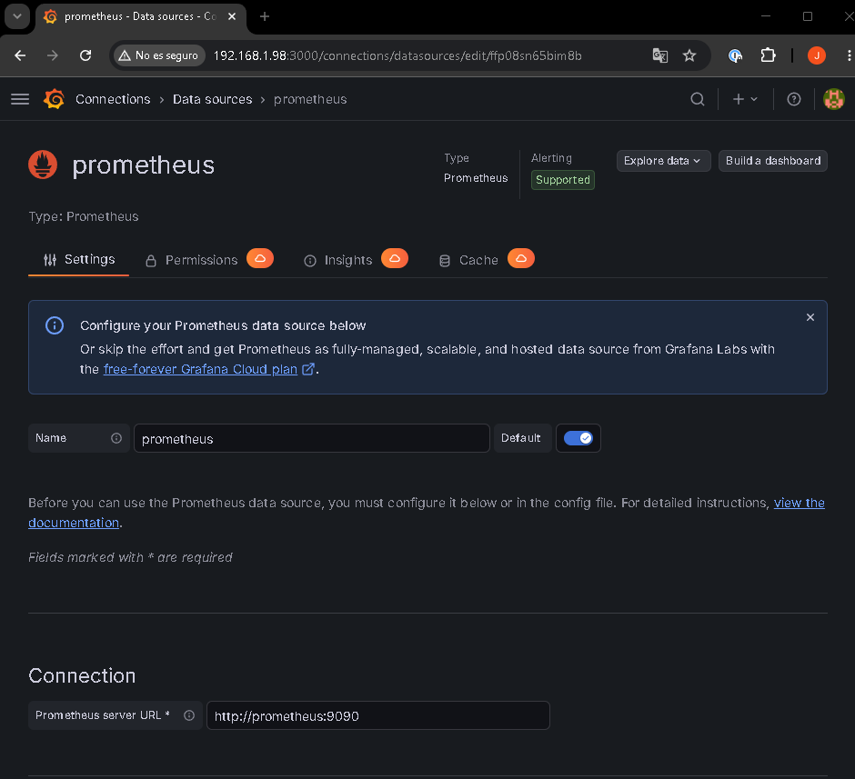
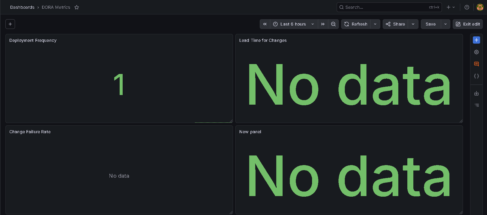

# DevOps Research & Assessment

## Objective
Create the ultimate analytics tool that Chief Technology Officers (CTOs) are looking for. An automated Grafana dashboard that measures the performance of your DevOps team using industry-standard metrics.

### Configure your Week 8 GitHub Actions pipeline so that, every time it makes a successful deployment or logs a failure, it sends a custom HTTP metric request to your Prometheus server or saves a record to a small MySQL database (Week 6).
First, we check that `docker` and `docker-compose` are installed:

Now we set up the directory and file structure:

- **`prometheus:`:** Starts Prometheus, which will store the metrics.

- **`pushgateway:`:** Starts Pushgateway, which will receive the metrics sent via HTTP.

- **`grafana:`:** Starts Grafana, where you will create the dashboard.

- **`ports: ‘9091:9091’`:** Opens Pushgateway on port `9091`.

- **`scrape_interval: 15s`:** Prometheus will read metrics every 15 seconds.

- **`job_name: ‘pushgateway’`:** The name of the job that will appear in Prometheus.

- **`targets: [‘pushgateway:9091’]`:** Prometheus will collect metrics from Pushgateway. In Prometheus, a `scrape_config` defines which targets are to be queried.

Once the files have been created, we start Prometheus, Pushgateway and Grafana:

We test a metric and access Prometheus in our browser: `echo “dora_deployment_timestamp_seconds{project=‘my-app’,status=“success”,run_id=‘manual-001’} 1781344800” \ | curl --data-binary @- http://localhost:9091/metrics/job/dora/project/my-app/run/manual-001`

### In Grafana, bring this data together and create a unified technical ‘DORA Metrics’ dashboard with visual indicators in Green/Yellow/Red. This will be the crowning glory of your portfolio!
We access Grafana in our browser and navigate to Connections > Data sources > Add data source > Prometheus to add a data source:

The next step is to create the ‘DORA Metrics’ dashboard under Dashboards > New > New dashboard. This dashboard will have 4 panels:
- **Deployment Frequency:**
    - Type: Stat  
    - PromQL: `count(dora_deployment_timestamp_seconds{project=‘my-app’,status=‘success’})`
    - Returns: Total number of successful deployments.

- **Lead Time for Changes:**
    - Type: Stat  
    - PromQL: `avg(dora_lead_time_seconds{project=‘my-app’}) / 60`
    - Returns: Average deployment time in minutes.

- **Change Failure Rate:**
    - Type: Gauge  
    - PromQL: `(count(dora_deployment_result{project=‘my-app’,status=“failed”})/count(dora_deployment_result{project=‘my-app’})) * 100`
    - Returns: Percentage of failed deployments.

- **Deployment Frequency:**
    - Type: Stat  
    - PromQL: `avg(dora_restore_time_seconds{project=‘my-app’}) / 60`
    - Returns: Average recovery time in minutes.

