# Zero-Trust Architecture with Istio

## Objective
Implement security at the internal network level without touching a single line of application code. Enforce mutual data encryption and control intelligent routing.

### Download and install istioctl on your operating system. Deploy the basic Istio Service Mesh profile to your Kubernetes cluster.
The official Istio documentation allows you to download the latest version using this command on Linux/macOS, and the `istioctl` binary is located in the `bin/` folder:

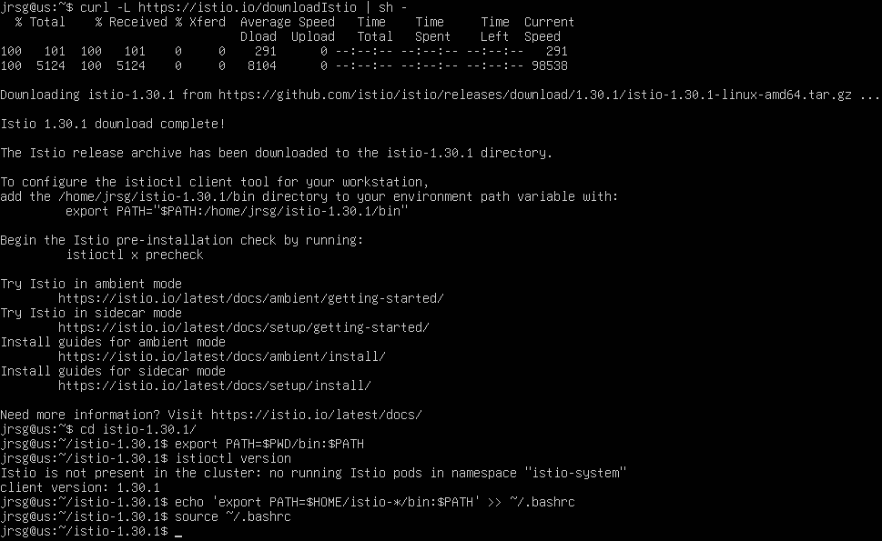

Now we install Istio on the cluster:

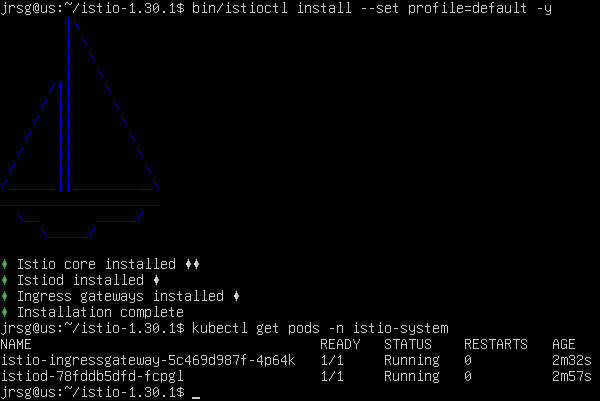

### Enable automatic proxy injection in your namespace: `kubectl label namespace default istio-injection=enabled`

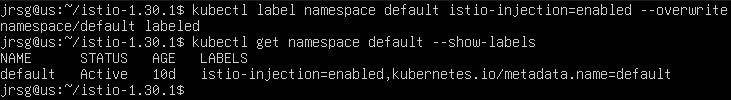

### Deploy your Flask application and the Redis database again. You will notice that each pod now has two containers running (your application + the Istio Envoy proxy regulating traffic).
You will now create a simple Flask app and a Redis database. As the namespace already has automatic injection enabled, new pods will have two containers:

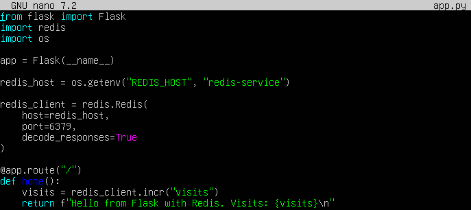

- **`app = Flask(__name__)`:** Creates the Flask application.

- **`redis_host = os.getenv(‘REDIS_HOST’, ‘redis-service’)`:** Finds Redis using the Kubernetes Service name.

- **`redis_client = redis.Redis(...)`:** Establishes the connection to Redis.

- **`visits = redis_client.incr(‘visits’)`:** Increments a counter every time you visit the website.

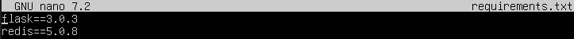

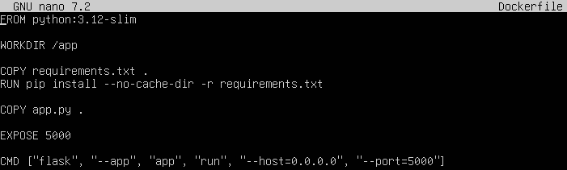

- **`FROM python:3.12-slim`:** Uses a lightweight Python image.

- **`WORKDIR /app`:** Defines the container’s working directory.

- **`RUN pip install --no-cache-dir -r requirements.txt`:** Installs Flask and Redis.

- **`CMD [...]`:** Starts Flask on port 5000.

We build the image in Minikube:

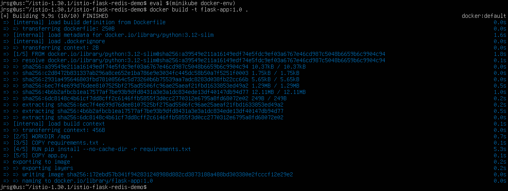

We create Redis and Flask in a single file:

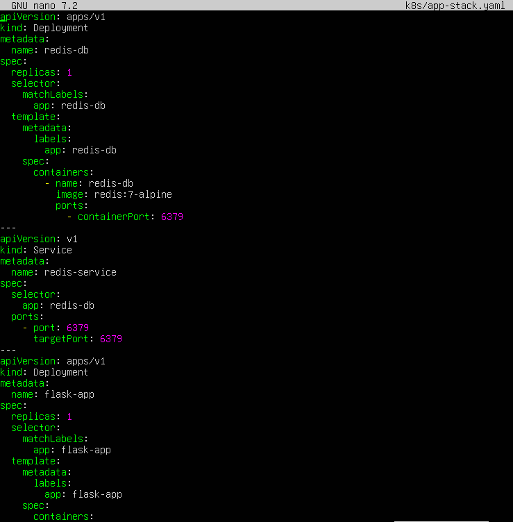

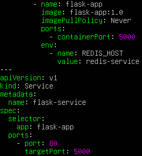

- **`name: redis-db`:** Name of the Redis Deployment.

- **`name: redis-service`:** Internal name that Flask will use to locate Redis.

- **`name: flask-app`:** Name of the Flask Deployment.

- **`imagePullPolicy: Never`:** Required in Minikube to use the local flask-app:1.0 image.

- **`value: redis-service`:** Tells Flask where Redis is located.

- **`name: flask-service`:** Internal service for accessing Flask within the cluster.

We apply the file and check the pods:

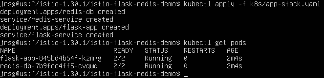

### Apply a PeerAuthentication configuration file setting the mode to STRICT. From this point onwards, Istio will enforce that all containers exchange cryptographic certificates when communicating with one another (mTLS).
`PeerAuthentication` defines whether Istio allows or requires mTLS on incoming connections. In `STRICT` mode, Istio requires mTLS traffic to sidecars:

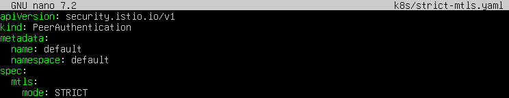

- **`kind: PeerAuthentication`:** Creates an Istio authentication policy.

- **`namespace: default`:** The policy applies to the default namespace.

- **`mode: STRICT`:** Enforces the use of mTLS. Traffic without valid certificates will be rejected.

We apply the policy and check:

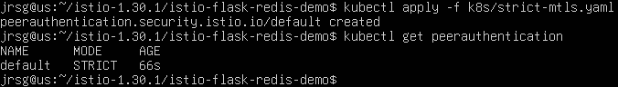

### Launch an intruder pod without a proxy within the cluster and try to use curl to access your web application. You will see that the connection is automatically rejected at the network level due to a lack of trusted certificates. All internal traffic is now secure and opaque to eavesdroppers.
First, let’s create a standard pod with a sidecar and check whether it can access the service:

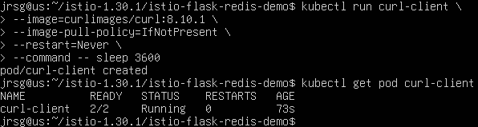

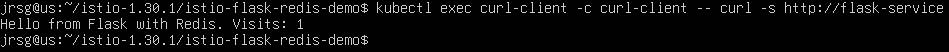

Now let’s create the intruder pod file:

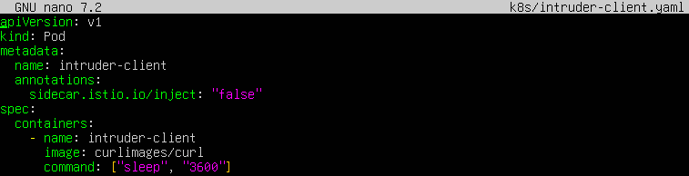

- **`name: intruder-client`:** Name of the intruder pod.

- **`sidecar.istio.io/inject: ‘false’`:** Prevents Istio from adding the Envoy proxy.

- **`image: curlimages/curl`:** Uses an image that includes curl.

We deploy the file and check whether the created pod can access Flask:

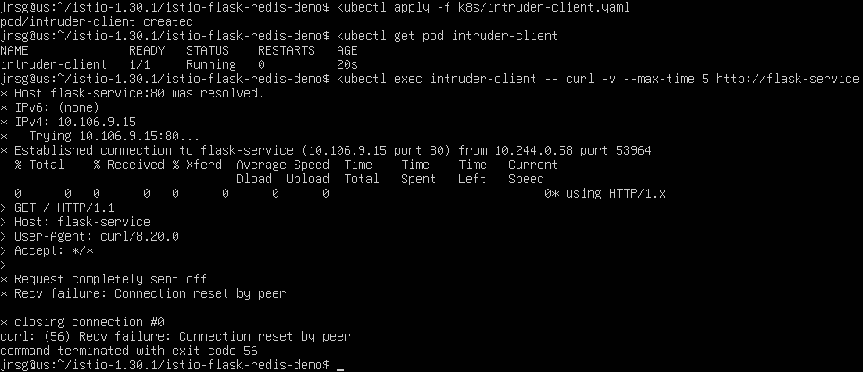