# The Enterprise Cloud Native Platform

## Objective
The big final test of your career relaunch. Integrating, end-to-end and in real time, all the technological components you have mastered over the past 10 weeks.

### Run your code to set up the secure VPC, the RDS databases and the managed AWS EKS Kubernetes cluster. Once complete, Terraform should automatically install ArgoCD on the cluster.
First, let’s create the directory and file structure:

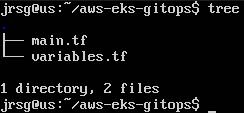

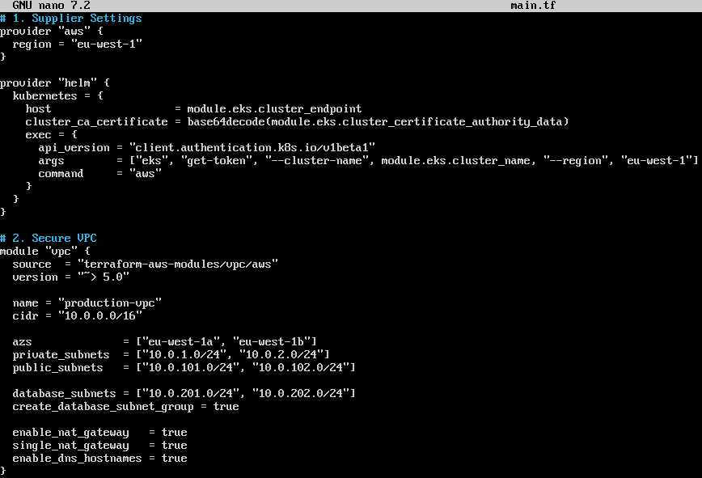

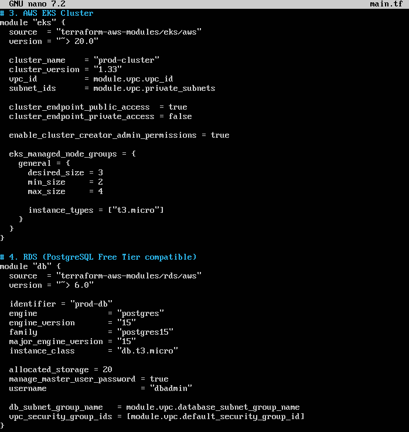

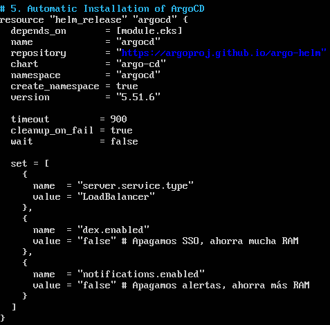

The most important lines are:
- **`exec = { \ api_version = ‘client.authentication.k8s.io/v1beta1’ \ args        = [“eks”, ‘get-token’, ‘--cluster-name’, module.eks.cluster_name, ‘--region’, ‘eu-west-1’] \ command     = ‘aws’ \ }`:** Terraform needs permissions to install things within Kubernetes. Instead of hard-coding passwords (which is very insecure), this block of code tells Terraform: “When you need to access the cluster, run the command `aws eks get-token` in the background to generate a temporary 15-minute VIP pass”. Adding `--region` prevented the command from failing silently.

- **`database_subnets = [‘10.0.201.0/24’, ‘10.0.202.0/24’]`:** This is the line that resolved the RDS crash. AWS requires databases to have their own subnet group, isolated from the rest of the servers for security reasons. By defining them here, Terraform built the house with a specific room for the database.

- **`single_nat_gateway = true`:** A NAT Gateway allows your private nodes (such as those in EKS) to access the internet to download updates. By default, AWS creates one for each availability zone, and they cost around ~$32 USD per month each. By setting this to true, we centralise traffic and avoid additional charges on your account.

- **`cluster_endpoint_public_access           = true \ cluster_endpoint_private_access          = false`:** This was the solution to the ‘dial tcp 10.0.2.41:443: i/o timeout’ error. By disabling private access and enabling public access, we allow the computer on which you are running Terraform (your Ubuntu Server) to find the cluster’s main gateway via the Internet, rather than getting stuck trying to find an internal IP address to which it has no access.

- **`enable_cluster_creator_admin_permissions = true`:** From EKS v20 onwards, AWS introduced Access Entries. This means that, by default, not even the cluster creator has permissions within the cluster (the ‘Zero Trust’ model). This line restores global administrator privileges so that Terraform (and you yourself) can operate the cluster.

- **`manage_master_user_password = true`:** This is one of the modern best practices in cybersecurity. Instead of hard-coding a password (where anyone could read it on GitHub), this tells AWS: “Generate an ultra-secure password, apply it to the database and store it securely in AWS Secrets Manager”.

- **`depends_on = [module.eks]`:** Terraform is very aggressive and tries to create everything at once to speed things up. This line acts as a physical barrier, warning it: “Don’t even think about trying to install ArgoCD until the EKS cluster and all its nodes are 100% operational.” It prevents fatal concurrency errors.

- **`wait = false`:** Our famous “Fire and Forget”. As we’re using t3.micro nodes with very little RAM, ArgoCD takes an age to start up. If Terraform waits for it to finish, it times out and fails. With this setting, we send the installation command to Kubernetes and let it deal with the slowness in the background.

- **`{ \ name  = ‘dex.enabled’ \ value = ‘false’ \ }`:** ArgoCD’s ‘diet’. Disabling the SSO module (dex) and the alerting system (notifications) is what allowed us to fit this massive enterprise-grade tool within the limited resources of your Free Tier.

We’ll get started and run Terraform:
```
terraform init
terraform apply -auto-approve
```

### Make a code change to your Python application on GitHub:
We’re going to create two repositories on GitHub:

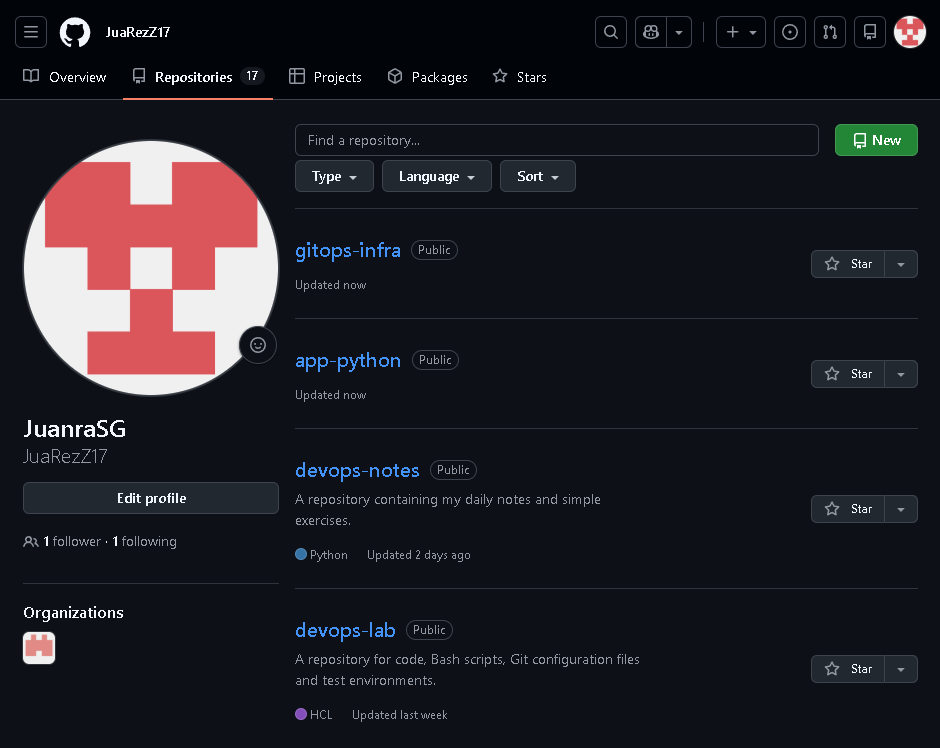

We’re also going to generate a Personal Access Token (PAT) on GitHub with write permissions for repositories (repo) and save it in the Secrets of the app-python repository under the name GITOPS_PAT:

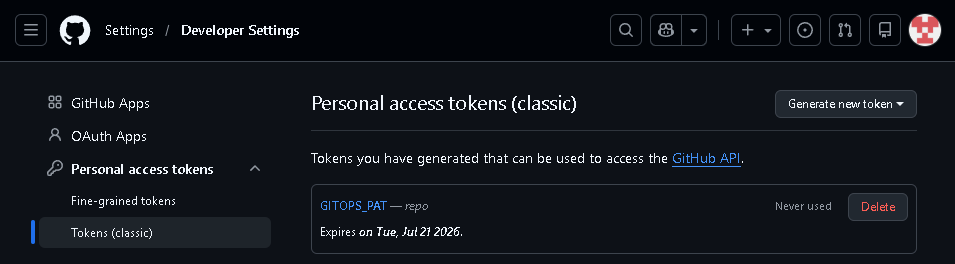

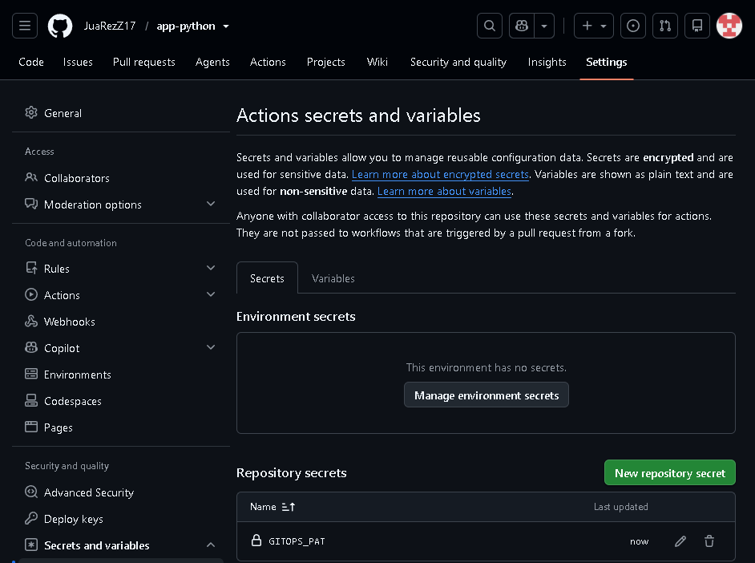

#### The GitHub Actions pipeline should start, pass the linters and security tests, build the optimised Docker image, upload it to GitHub Packages and autonomously update the GitOps repository.
Let’s create the application’s directory and file structure. First, the infrastructure repository:

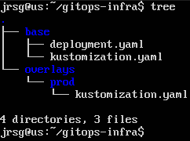

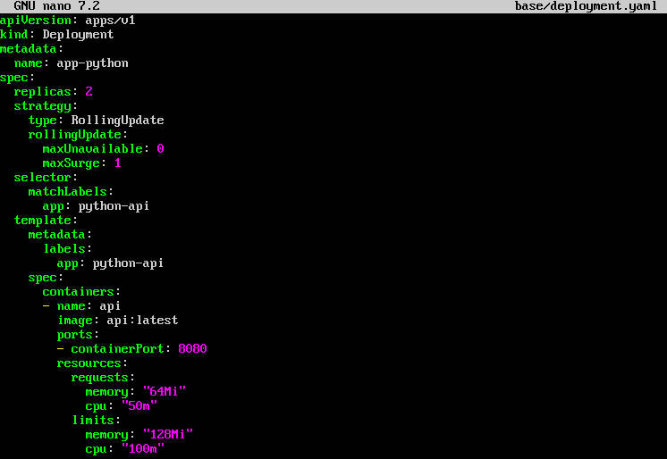

The most important lines are:
- **`strategy: type: RollingUpdate`:** This is the magic behind ‘Zero Downtime’. It tells Kubernetes: ‘When a new version is available, start the new container first (maxSurge: 1) and do not delete the old one until the new one is working perfectly (maxUnavailable: 0)’.

- **`image: api:latest`:** This is a placeholder name. We don’t want to specify the actual image here because Kustomize will inject it dynamically later on.

- **`resources: limits: memory: ‘128Mi’`:** Our lifeline. It strictly prevents this container from using more than 128 megabytes of RAM. Without this line, the t3.micro nodes in your free tier would have crashed.

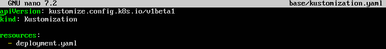

This file tells the Kustomize tool which files make up the project’s base structure and where they are located.

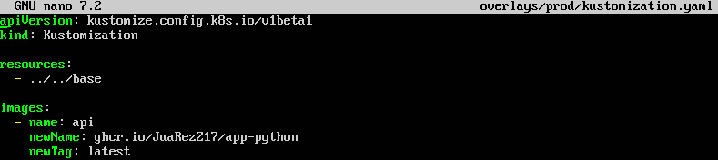

The most important lines are:
- **`resources: - ../../base`:** Inherits all the configuration from the base template (the deployment with its RAM limits).

- **`images: - name: api`:** Looks for the placeholder named ‘api’ that we left in the base file and replaces it with the actual path to your Docker registry on GitHub (newName).

- **`newTag`:** It says ‘latest’ here, but the GitHub Actions pipeline will automatically update this exact line every time you push new code.

We push the changes to the “gitops-infra” repository:

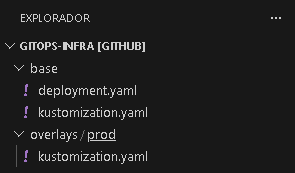

Now let’s move on to the application repository:

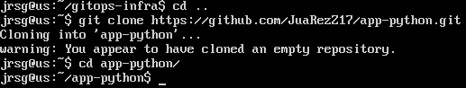

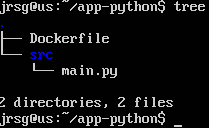


The most important line is:
- **`(‘’, PORT)`:** By leaving the IP address blank (or using 0.0.0.0), we allow the server to listen for requests from any network interface. This is mandatory in Docker/Kubernetes; if you were to specify `localhost` or `127.0.0.1`, the container would be isolated and ArgoCD would be unable to communicate with it.

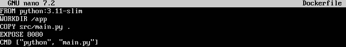

The most important lines are:
- **`FROM python:3.11-slim`:** We use the slim version of Linux. It takes up much less space (ideal for our Free Tier) and has fewer security vulnerabilities than the full version.

- **`CMD [‘python’, ‘main.py’]`:** This is the container’s startup command. Unlike `RUN` (which runs when the image is built), `CMD` runs when Kubernetes starts the Pod.

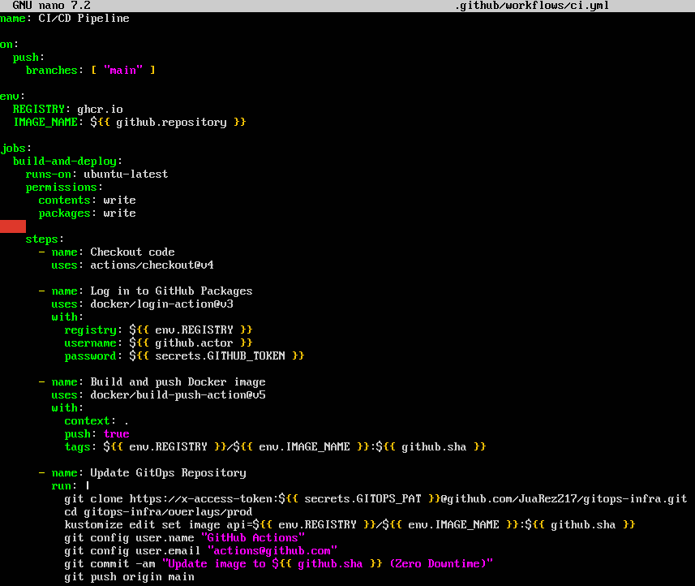

The most important lines are:
- **`permissions: packages: write`:** This grants temporary permissions to the GitHub Actions machine to push the final Docker image to your public/private GitHub registry (GHCR).

- **`tags: ...:${{ github.sha }}`:** Instead of using the `latest` tag, we use the unique commit hash (`github.sha`). This ensures that each image is immutable and traceable. If there is an error, you can revert to the previous version with mathematical precision.

- **`kustomize edit set image...`:** The heart of GitOps. This command opens your `kustomization.yaml` file from the infrastructure repository and replaces the `newTag` line with the identifier of the newly built commit.

We push the changes to GitHub:

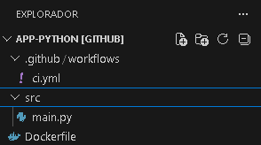

#### ArgoCD should detect the update within seconds using Kustomize, reconcile the state and roll out the new version to AWS progressively (zero downtime).
First, let’s retrieve Argocd’s IP address and password from Ubuntu:

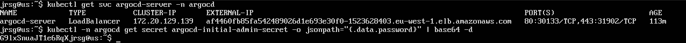

We access the external IP in our browser and enter the credentials:

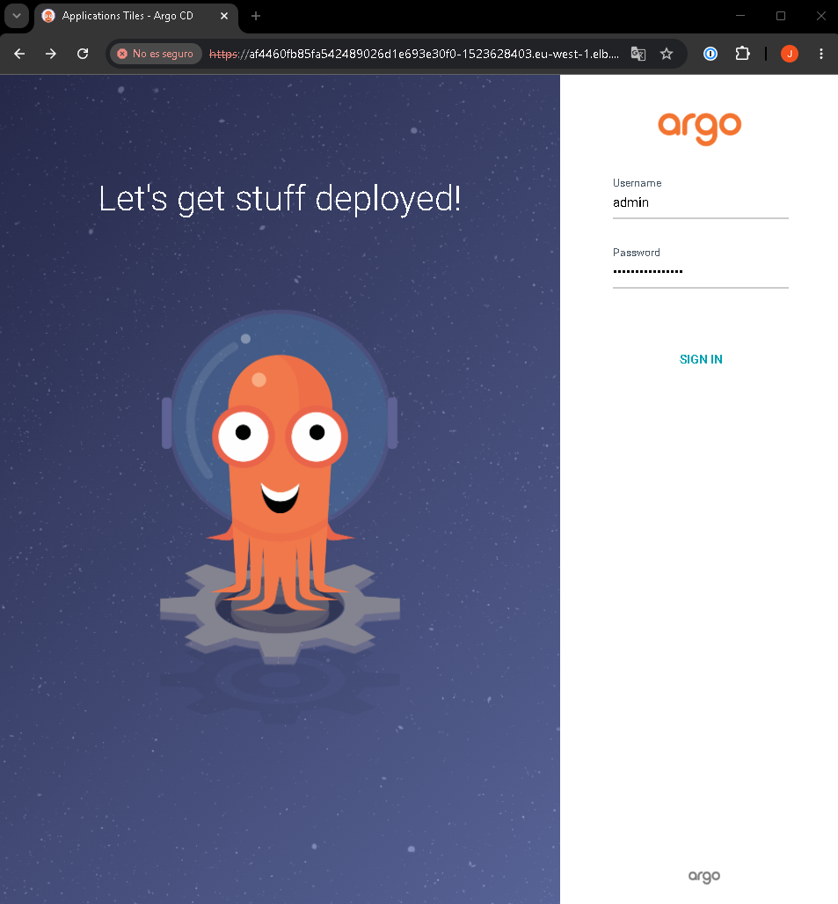

Once logged in, we create a new app with the following settings:

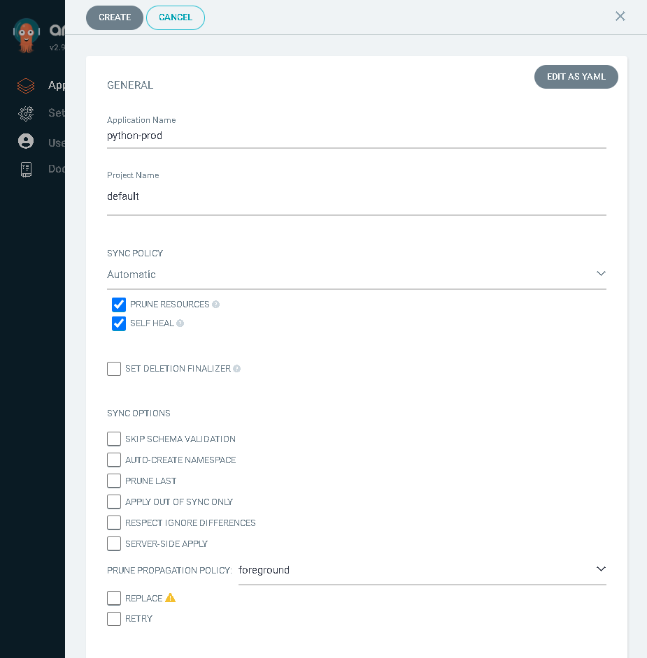

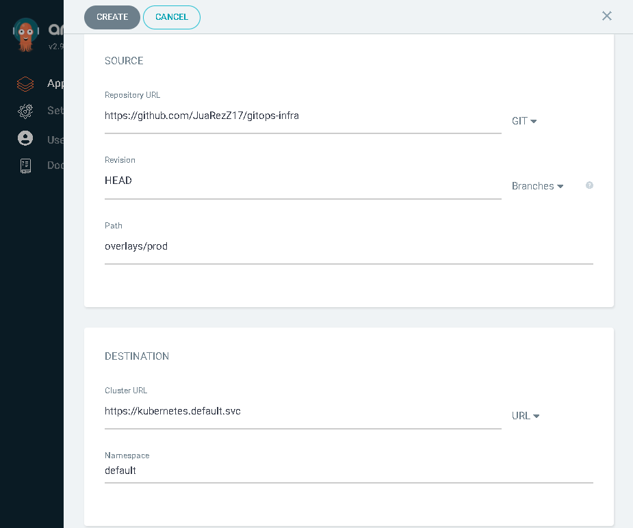

Finally, let’s create the app:

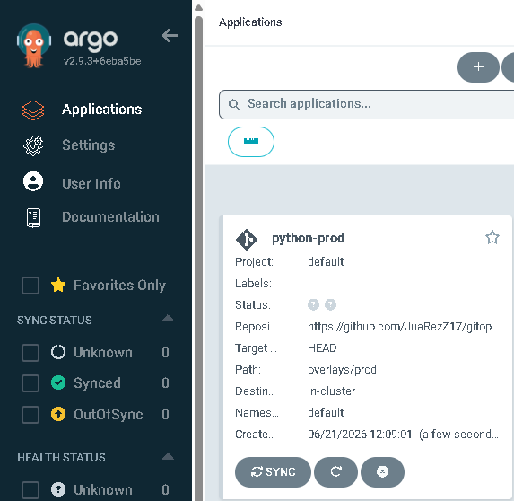

### The app’s traffic should be automatically captured by your Prometheus and Grafana Loki stack, displaying health metrics in real time.
Prometheus and Loki are not installed by default in Kubernetes. They are installed using Helm:

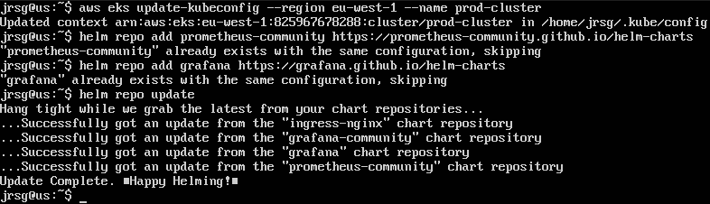

We deploy Prometheus:
```
helm install monitoring prometheus-community/kube-prometheus-stack \
  --namespace monitoring --create-namespace \
  --set defaultRules.create=false \
  --set alertmanager.enabled=false \
  --set grafana.service.type=LoadBalancer \
  --set prometheus.prometheusSpec.resources.requests.memory=‘64Mi’ \
  --set prometheus.prometheusSpec.resources.limits.memory=‘128Mi’ \
  --set prometheusOperator.admissionWebhooks.enabled=false \
  --set prometheusOperator.tls.enabled=false \
  --set nodeExporter.enabled=false \
  --set kubeStateMetrics.enabled=false \
  --wait=false
```

The most important lines are: 
- **`--set prometheusOperator.admissionWebhooks.enabled=false \ --set prometheusOperator.tls.enabled=false`:** These two lines are the exact solution to the ‘timed out waiting for the condition’ error shown in your latest screenshot. By default, Prometheus runs a small preliminary task (a Job) to generate internal security certificates before installing itself. As your nodes had no free RAM, that task got stuck waiting. By setting these to false, we’re telling Helm: “Skip the internal certificate validation and go straight in; we don’t have enough RAM for secondary security protocols”.

- **`--set nodeExporter.enabled=false \ --set kubeStateMetrics.enabled=false`:** nodeExporter and kubeStateMetrics are like two additional ‘spies’ that Prometheus installs by default on each of your nodes to gather ultra-detailed metrics on the hardware and the state of Kubernetes. By disabling them, we lose that depth of data, but in return we avoid running between 3 and 5 extra containers, saving hundreds of megabytes of memory.

- **`--set prometheus.prometheusSpec.resources.requests.memory=‘64Mi’ \ --set prometheus.prometheusSpec.resources.limits.memory=‘128Mi’`:** Prometheus is a time-series database that consumes gigabytes of RAM in production environments. Here, we’re putting it in a straitjacket. We’re instructing Kubernetes to allocate a maximum of 128 megabytes; if it tries to exceed that limit, the system will restart it rather than letting it consume what little memory the machine has left and bring down your cluster.

- **`--wait=false`:** This is the same concept we use with Terraform. Helm monitors the installation and, if everything isn’t green within 5 minutes, it fails and destroys the installation (causing the error you saw). With this flag, Helm simply deploys the blueprints into Kubernetes, returns control of the terminal to you immediately, and lets the cluster sort things out at its own pace in the background, starting up the containers as space becomes available.

We deploy Loki and Promtail:
```
helm install loki grafana/loki-stack \
  --namespace monitoring \
  --set grafana.enabled=false \
  --set prometheus.enabled=false \
  --set promtail.resources.limits.memory=‘64Mi’ \
  --set loki.resources.limits.memory=‘128Mi’
```

The most important lines are:
- **`--set grafana.enabled=false`:** The Loki repository attempts to install another instance of Grafana by default. We tell it not to, because we’ve already installed one in Step 2 and we’re going to connect them.

- **`--set promtail.resources.limits.memory=‘64Mi’`:** Promtail is lightweight, but we’re setting a strict limit of 64MB just in case.

Due to memory issues, the following steps cannot be carried out, but they would be as follows:
1. Log in to Grafana using the username “admin” and password “prom-operator”.

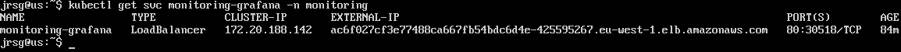

2. View the app’s health using Prometheus (left-hand menu > Dashboards > kube-prometheus-stack > kubernetes > compute resources > namespace (Pods)).

3. View the app’s logs using Loki (left-hand menu > Connections > Data Sources > Add data source > Loki). In the URL field, enter `http://loki:3100`.